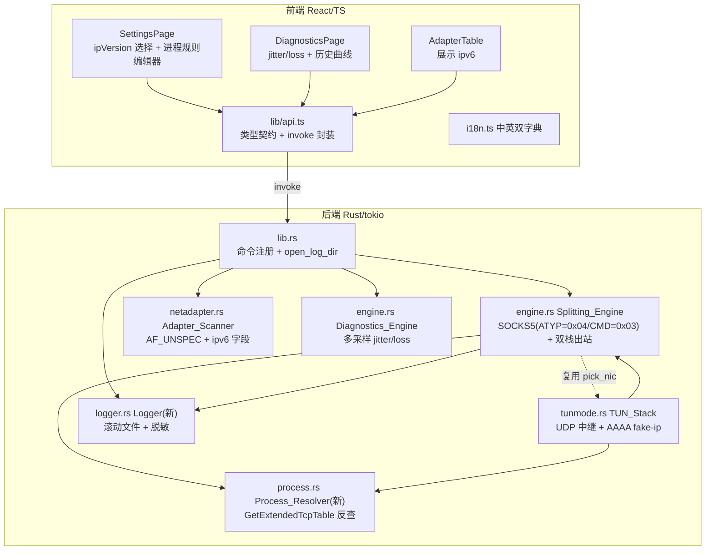
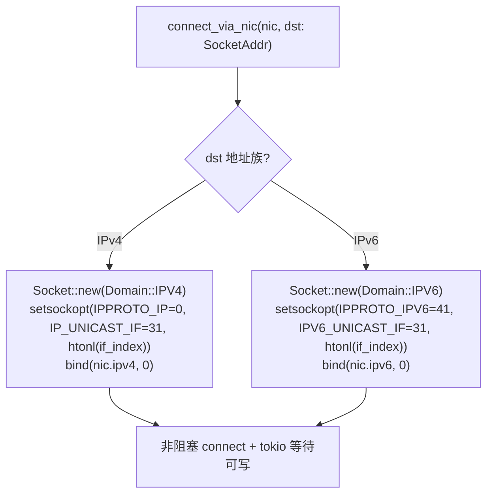
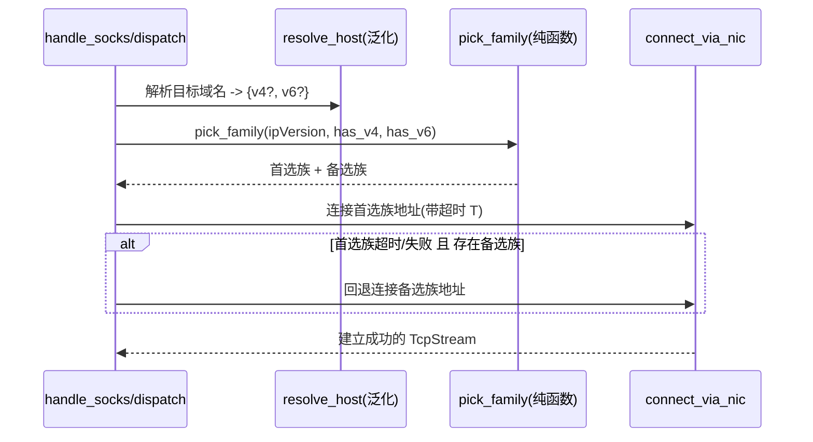

# Design Document

## Overview

本设计基于已确认的 `requirements.md`，为 HypoMuxPlus 的一次网络能力扩展与工程补强给出可落地的技术方案，覆盖 10 条需求：IPv6/双栈分流、网卡 IPv6 扫描展示、TUN 模式 UDP/QUIC 中继、可选 SOCKS5 UDP ASSOCIATE、按进程名分流、Rust 后端单元测试、前端 vitest 测试、本地滚动日志、诊断抖动/丢包探测、诊断历史曲线与报告导出。

设计的第一约束是**对既有 IPv4/TCP/DNS/限速/调度路径零破坏**：所有既有函数的对外行为保持不变，新能力以「泛化 + 分支」而非「替换」的方式引入。核心手法是把当前钉死在 `Ipv4Addr` / `SocketAddrV4` 上的类型逐步泛化为 `IpAddr` / `SocketAddr`，为 IPv4 保留原有代码路径（`Domain::IPV4` + `IP_UNICAST_IF`），为 IPv6 增加平行分支（`Domain::IPV6` + `IPV6_UNICAST_IF`）。

技术栈沿用现状：Tauri 2 + Rust(tokio) 后端、React 19 + TypeScript 前端、`windows-sys`/`socket2` 直接调用 Win32、`ipstack` + `tun`(wintun) 的用户态栈、前端 `i18n.ts` 中英双字典。

### 关键设计决策与依据

- **地址族泛化优先于一切**：IPv6（Req 1/2）、UDP/QUIC 中继（Req 3）、按进程分流（Req 5 需要 `AF_INET6` 连接表）都建立在「引擎不再假设 IPv4」的基础上。因此把 `SocketAddrV4 → SocketAddr` 的泛化列为第一实现阶段。
- **可测性重构服务于测试需求**：Req 6/7 要求对纯函数做单元测试与 round-trip 测试。为此需把「地址族选择」「进程名匹配」「抖动/丢包统计」「日志脱敏」等逻辑从含 socket/AppHandle 的函数中析出为不依赖 IO 的纯函数。这既是测试前提，也顺带降低了新功能的耦合度。
- **UDP 中继采用地址级转发而非协议解析**：QUIC 端到端加密，TUN 侧只做「按网卡出口绑定的 UDP socket 中继 + fake-ip 反查」，不解析载荷，符合 Req 3 边界。
- **进程反查只在新连接建立时查一次并缓存**：`GetExtendedTcpTable` 是相对昂贵的系统调用，按包查询不可接受；用短 TTL 缓存的 `(localAddr,localPort)->PID->name` 表，把开销限定在每条新连接一次。
- **日志选型采用轻量自研 appender**：项目已有 `emit("hmx-log")` 的统一日志入口与中英双语日志，直接在其基础上加一层「滚动文件 + 脱敏」的 sink，避免引入 `tracing` 全家桶带来的宏侵入与体积膨胀（下文 Testing Strategy 会说明该选择对可测性的影响）。

## Architecture

### 系统分层与本次改动落点



### 出站连接工厂的双栈泛化（Req 1 的地基）

当前 `connect_via_nic(nic, dst: SocketAddrV4)` 固定 `Domain::IPV4` + `IP_UNICAST_IF(31, level=IPPROTO_IP=0)`。泛化为按目标地址族分派：



关键常量与 setsockopt 说明：
- IPv4：`level = IPPROTO_IP = 0`，`optname = IP_UNICAST_IF = 31`，`optval = htonl(if_index)`（网络字节序，即现有 `if_index.to_be()`）。
- IPv6：`level = IPPROTO_IPV6 = 41`，`optname = IPV6_UNICAST_IF = 31`，`optval = htonl(if_index)`。**注意**：IPv6 的 `IPV6_UNICAST_IF` 与 IPv4 数值同为 31，但 level 不同；且 optval 同样要求主机序接口索引以网络字节序传入（Windows 对这两个选项均按 `htonl(ifindex)` 处理，沿用现有 `to_be()` 写法）。
- `IPPROTO_IPV6 = 41` 定义为 `engine.rs` 内新增常量。

### Happy-Eyeballs 式双栈回退（Req 1.5/1.6）



### 实现顺序与依赖（关键）

1. **阶段 A — 地址族泛化（前置基础，服务 Req 1/2/3/5）**
   - `SelectedNic`/`NicRuntime` 增加 `ipv6: Option<Ipv6Addr>`；`connect_via_nic` 泛化为 `SocketAddr`；`resolve_host` 返回 `SocketAddr`。
   - `netadapter.rs` 改 `AF_UNSPEC`，`AdapterInfo` 增加 `ipv6` 字段。
   - 抽出纯函数 `pick_family`、`select_global_ipv6`（可测）。
2. **阶段 B — SOCKS5 IPv6 与双栈策略（Req 1）**：`handle_socks` 增加 `ATYP=0x04`；接入 `pick_family` + 回退。
3. **阶段 C — 可测性重构（服务 Req 6，可与 A/B 并行）**：把 DNS 解析、地址族选择、进程名匹配、jitter/loss、日志脱敏析出为纯函数。
4. **阶段 D — 按进程分流（Req 5，依赖 A）**：新增 `process.rs`；`RouteRuleDef` 增加进程规则；`pick_nic` 前置进程匹配。
5. **阶段 E — TUN UDP/QUIC 中继（Req 3，依赖 A/D）**：`handle_udp` 非 53 端口建立 UDP 中继；会话表 + 空闲回收。
6. **阶段 F — SOCKS5 UDP ASSOCIATE（Req 4，可选，依赖 A）**：`CMD=0x03` 分配中继端口；未启用则拒绝。
7. **阶段 G — 日志（Req 8）**：新增 `logger.rs`；`open_log_dir` 命令。
8. **阶段 H — 诊断增强（Req 9/10，依赖 A 的地址族无关，可较早并行）**：`test_latency` 多采样；前端历史曲线。
9. **阶段 I — 测试落地（Req 6/7）**：Rust `#[cfg(test)]` + 前端 vitest，覆盖 C/所有纯函数。

## Components and Interfaces

下列为模块级改动清单与关键接口签名（细化到函数签名级别）。标注 `[新增]`/`[泛化]`/`[新分支]`/`[不变]`。

### 1) `netadapter.rs` — Adapter_Scanner（Req 2）

```rust
// [泛化] AdapterInfo 增加 ipv6 字段（既有字段与行为不变）
#[derive(Debug, Clone, Serialize)]
#[serde(rename_all = "camelCase")]
pub struct AdapterInfo {
    pub index: u32,
    pub alias: String,
    pub ipv4: String,          // [不变] 首个 IPv4 单播地址
    pub ipv6: String,          // [新增] 代表性全局单播 IPv6；无则 ""
    pub description: String,
    pub is_up: bool,
    pub is_virtual: bool,
}

// [泛化] GetAdaptersAddresses(AF_UNSPEC)；遍历 FirstUnicastAddress 同时收集 v4/v6
pub fn scan_adapters() -> Result<Vec<AdapterInfo>, String>

// [新增-纯函数] 从一组 IPv6 单播地址中挑代表：全局单播优先于 fe80::/10 链路本地
pub(crate) fn select_global_ipv6(addrs: &[Ipv6Addr]) -> Option<Ipv6Addr>
// [新增-纯函数] 判定是否链路本地（fe80::/10）
pub(crate) fn is_link_local_v6(ip: &Ipv6Addr) -> bool
```

改动要点：`GetAdaptersAddresses` 的 family 参数由 `AF_INET` 改为 `AF_UNSPEC`；遍历单播链表时对 `AF_INET` 分支保留既有取首个 IPv4 逻辑（行为不变），新增 `AF_INET6` 分支从 `SOCKADDR_IN6` 收集地址，再经 `select_global_ipv6` 选代表。`is_virtual` 判定逻辑不变。

### 2) `engine.rs` — Splitting_Engine（Req 1/3/4/5/9）

```rust
// [泛化] 运行时网卡：同时持有 v4/v6 源地址与 if_index
pub struct NicRuntime {
    pub name: String,
    pub ipv4: Ipv4Addr,             // [改名自 ip]（内部字段，非序列化，影响面可控）
    pub ipv6: Option<Ipv6Addr>,     // [新增]
    pub if_index: u32,
    // ... active/speed/alive/weight/limiter 均 [不变]
}

// [泛化] 出站工厂：dst 由 SocketAddrV4 泛化为 SocketAddr，按族分派
async fn connect_via_nic(nic: &NicRuntime, dst: SocketAddr) -> std::io::Result<TcpStream>

// [新增-纯函数] 双栈首选/备选族决策（不依赖 IO，可测）
pub(crate) enum Family { V4, V6 }
pub(crate) fn pick_family(pref: &str, has_v4: bool, has_v6: bool) -> Vec<Family>
//   pref ∈ {"auto","v4first","v6first","v4only"}；返回按优先级排列的可尝试族列表
//   auto 默认等价 v6first（有 v6 全局地址时优先），可在实现时明确；v4only 仅返回 [V4]

// [泛化] 经网卡解析：返回 v4/v6 候选（AAAA 查询新增）
struct ResolvedAddrs { v4: Option<Ipv4Addr>, v6: Option<Ipv6Addr> }
async fn resolve_host_dual(&self, nic: &NicRuntime, host: &str, port: u16) -> ResolvedAddrs

// [新增-纯函数] 构造 AAAA(type=28) 查询 & 解析 AAAA 应答（与既有 A 记录函数配对）
fn build_dns_query_type(host: &str, qtype: u16) -> Vec<u8>   // A=1, AAAA=28
fn parse_dns_aaaa(buf: &[u8]) -> Option<Ipv6Addr>

// [不变] 既有纯函数：pattern_match / build_dns_query / parse_dns_a / dns_skip_name
//        / split_host_port / build_origin_header / find_header / Strategy::parse

// [泛化] handle_socks：新增 ATYP=0x04 解析分支；接入 pick_family + 回退；
//        CMD=0x03(UDP ASSOCIATE) 分派到 udp_associate（可选）或标准拒绝
async fn handle_socks(engine: Arc<Engine>, client: TcpStream) -> std::io::Result<()>

// [新增] 双栈拨号：按 pick_family 顺序尝试，带 per-family 超时回退
async fn dial_dual(nic: &NicRuntime, addrs: &ResolvedAddrs, port: u16,
                   pref: &str, timeout: Duration) -> std::io::Result<TcpStream>
```

Engine 结构新增字段：`ip_version: String`（来自前端设置，默认 `"auto"`）、`udp_associate: bool`（Req 4 开关）、`rules_proc: Vec<(String, RuleAction)>`（进程规则，见下）。

进程规则接入 `pick_nic`：

```rust
// [泛化] 规则动作枚举，供进程/域名规则复用
pub(crate) enum RuleAction { Direct, Aggregate, Nic(u32) }

// [泛化] pick_nic 先按进程名匹配（优先级高于域名），再回退域名规则/调度
fn pick_nic(&self, host: &str, port: u16, proc_name: Option<&str>)
    -> (Arc<NicRuntime>, bool /*is_direct*/)

// [新增-纯函数] 进程名匹配：大小写不敏感精确匹配，返回命中动作
pub(crate) fn match_proc_rule(rules: &[(String, RuleAction)], proc_name: &str) -> Option<RuleAction>
```

### 3) `process.rs` — Process_Resolver（Req 5）[新增模块]

```rust
// (localAddr, localPort) -> PID 的短 TTL 缓存表，代理模式用
pub struct ProcessResolver {
    cache: Mutex<HashMap<(IpAddr, u16), (u32 /*pid*/, Instant)>>,
    name_cache: Mutex<HashMap<u32, (String, Instant)>>,
}

impl ProcessResolver {
    pub fn new() -> Self
    // 反查发起进程可执行文件名（小写）。带 TTL 缓存；查不到返回 None。
    // 内部：GetExtendedTcpTable(TCP_TABLE_OWNER_PID_ALL, AF_INET/AF_INET6)
    //       -> PID -> QueryFullProcessImageNameW（回退 toolhelp）
    pub fn resolve(&self, local: SocketAddr) -> Option<String>
}

// [新增-纯函数] 从 MIB_TCPTABLE_OWNER_PID 行集合按 (localAddr,localPort) 查 PID
//   入参为已解析出的行向量，便于单元测试（不触碰系统调用）
pub(crate) struct TcpRow { pub local_addr: IpAddr, pub local_port: u16, pub pid: u32 }
pub(crate) fn find_pid_by_endpoint(rows: &[TcpRow], local: SocketAddr) -> Option<u32>
// [新增-纯函数] 从完整路径提取小写可执行文件名（steam.exe）
pub(crate) fn exe_name_from_path(path: &str) -> String
```

性能说明：`resolve` 仅在新连接建立时调用一次；命中缓存（TTL 建议 1s：`(localAddr,localPort)->PID` 短命，进程名 TTL 可长至 10s）时零系统调用；避免每包开销。

TUN 模式（Req 5.5）：`handle_tcp`/`handle_udp` 从 `IpStackStream` 拿到原始本地端点（客户端在 wintun 上的源地址:源端口），以同法经 `GetExtendedTcpTable`/`GetExtendedUdpTable` 反查。

### 4) `tunmode.rs` — TUN_Stack（Req 3）

```rust
// [不变] FakeDns / parse_dns_question / build_dns_response / allocate / lookup
// [新增] AAAA 支持：parse_dns_question 返回 qtype；对 AAAA 分配同一 fake-ip 或回空
fn parse_dns_question(buf: &[u8]) -> Option<(u16 /*id*/, String, u16 /*qtype*/)>  // [泛化] 末位 bool->qtype

// [新增] UDP 会话表：客户端流 <-> 上游 UdpSocket 映射 + 空闲回收
struct UdpSession {
    upstream: Arc<tokio::net::UdpSocket>,  // 经 Egress_Binding 的网卡 UDP socket
    last_active: Instant,
    nic_name: String,
}
struct UdpSessionTable { inner: Mutex<HashMap<UdpKey, UdpSession>> }
type UdpKey = (SocketAddr /*client src*/, SocketAddr /*real dst*/);

// [新分支] handle_udp：非 53 端口不再丢弃，建立/复用经网卡的 UDP 中继
async fn handle_udp<S>(udp: S, dst: SocketAddr, socks_port: u16,
                       fake: Arc<FakeDns>, engine: Arc<Engine>, sessions: Arc<UdpSessionTable>)

// [新增] 经指定网卡创建出站 UDP socket（IPv4/IPv6 各自 *_UNICAST_IF + bind 源地址）
async fn udp_socket_via_nic(nic: &NicRuntime, family: Family) -> std::io::Result<tokio::net::UdpSocket>

// [新增-纯函数] 空闲会话筛选：给定当前时刻与超时，返回应回收的 key 列表
pub(crate) fn expired_udp_keys(entries: &[(UdpKey, Instant)], now: Instant, idle: Duration) -> Vec<UdpKey>
```

会话表结构与超时策略：
- key = `(客户端源端点, 真实目标端点)`；value 持有经所选网卡绑定的上游 `UdpSocket`、`last_active`、网卡名。
- 每次上下行数据往返刷新 `last_active`；后台 tokio 定时任务（如每 5s）调用 `expired_udp_keys`，回收 `idle > 60s`（建议）的会话，drop 其 socket 与映射。
- fake-ip 反查：`dst` 命中 `FakeDns::lookup` 得到域名后，经 `engine.resolve_host_dual` 用所选网卡解析真实地址再中继（Req 3.2）。
- 网卡选择复用 `engine.pick_nic`（含 bypass、按网卡规则、调度策略，Req 3.4）；进程规则经 Process_Resolver（Req 5.5）。

### 5) SOCKS5 UDP ASSOCIATE（Req 4，可选）[新增]

```rust
// [新增] CMD=0x03：在 127.0.0.1 分配 UDP 中继端口，应答返回 BND.ADDR/BND.PORT
async fn udp_associate(engine: Arc<Engine>, client: TcpStream) -> std::io::Result<()>
// [新增-纯函数] 解析 SOCKS5 UDP 请求头：RSV(2) FRAG(1) ATYP ADDR PORT，返回 (目标, 载荷偏移)
pub(crate) fn parse_socks_udp_header(buf: &[u8]) -> Option<(SocksUdpTarget, usize)>
// [新增-纯函数] 封装 SOCKS5 UDP 回复头（返回给客户端时加回请求头）
pub(crate) fn build_socks_udp_header(target: &SocksUdpTarget) -> Vec<u8>
```

未启用（`engine.udp_associate == false`，默认）时：`CMD=0x03` 走既有的「非 CONNECT 命令」拒绝分支（`REP=0x07`），Req 4.3 满足。`CMD=0x01`（CONNECT）路径完全不变（Req 4.4）。

### 6) `logger.rs` — Logger（Req 8）[新增模块]

```rust
pub struct Logger {
    dir: PathBuf,               // app_log_dir：%APPDATA%/com.qingyun.hypomuxplus/logs
    file: Mutex<Option<File>>,
    max_bytes: u64,             // 单文件上限（建议 2MB）
    max_files: usize,           // 保留历史数（建议 5）
    current_bytes: AtomicU64,
}
impl Logger {
    pub fn new(dir: PathBuf, max_bytes: u64, max_files: usize) -> Self
    // 写一条记录（时间戳+级别+脱敏消息）；失败则静默降级（Req 8.5）
    pub fn write(&self, level: LogLevel, msg: &str)
    fn rotate_if_needed(&self)  // 达上限则滚动并裁剪历史
}

// [新增-纯函数] 组装单行日志（可测，不做 IO）
pub(crate) fn format_log_line(ts: &str, level: LogLevel, msg: &str) -> String
// [新增-纯函数] 脱敏：IPv4/IPv6 掩码化、用户名路径替换为 <USER>（可测）
pub(crate) fn redact(msg: &str) -> String
// [新增-纯函数] 滚动决策：给定现有文件名列表返回应删除的最旧文件（可测）
pub(crate) fn files_to_prune(existing: &[String], max_files: usize) -> Vec<String>
```

脱敏规则：
- IPv4：保留前两段，后两段掩码 `192.168.*.*`；IPv6：保留前缀 `xxxx:xxxx::/32`，其余段掩码。
- 路径中的 `C:\Users\<name>\...` 的 `<name>` 段替换为 `<USER>`。
- 只脱敏「本机可标识信息」，公网目标 IP 不强制脱敏（便于排障），但完整数据报/负载绝不记录（Req 8 边界）。

统一日志入口：新增 `Engine.log` / 全局 `hmx_log(app, level, msg)` 辅助，在既有 `emit("hmx-log", msg)` 之后再调用 `Logger::write`（脱敏后写文件）。既有前端日志面板行为不变（Req 8.6）。

`lib.rs` 新增命令：

```rust
#[tauri::command] fn open_log_dir(app: AppHandle) -> Result<(), String>  // opener 打开日志目录
// Logger 实例挂到 AppState：pub log: OnceCell<Arc<Logger>>
```

### 7) `engine.rs` — Diagnostics_Engine（Req 9）

```rust
// [泛化] 多次采样的延迟结果（既有字段保留，behavior 不变）
#[derive(Debug, Clone, Serialize)]
#[serde(rename_all = "camelCase")]
pub struct LatencyResult {
    pub index: u32,
    pub name: String,
    pub latency_ms: i64,   // [不变] = avg（成功时），-1 表示全失败
    pub ok: bool,          // [不变]
    pub min_ms: i64,       // [新增]
    pub avg_ms: i64,       // [新增]
    pub jitter_ms: i64,    // [新增] RTT 样本标准差（或相邻差均值），全失败为 -1
    pub loss_pct: f64,     // [新增] 失败次数/总次数
}

// [泛化] 每张网卡多次 TCP 握手采样（默认 N=10），统计 min/avg/jitter/loss
pub async fn test_latency(selected: Vec<SelectedNic>) -> Vec<LatencyResult>

// [新增-纯函数] 从 RTT 样本(ms，None=失败)计算 min/avg/jitter/loss
pub(crate) struct LatencyStats { pub min: i64, pub avg: i64, pub jitter: i64, pub loss_pct: f64 }
pub(crate) fn compute_latency_stats(samples: &[Option<u64>]) -> LatencyStats
```

抖动定义：成功样本的标准差（毫秒，四舍五入）；样本数 <2 时 jitter=0。丢包率：`失败次数 / 总次数`。全失败时 `loss_pct=1.0`、`jitter=-1`（不可用）、`avg/min/latency_ms=-1`、`ok=false`（Req 9.3）。用户态 TCP 握手成功率法，不用原始 ICMP（Req 9 边界）。`latency_ms` 保持为「成功时的代表 RTT（=avg）」以兼容既有前端字段（Req 9.5）。

### 8) `lib.rs` — 命令与状态（跨切面）

```rust
// [泛化] start_boost 增加 ip_version / udp_associate 透传给 engine::start
// [泛化] AppState 增加 log: OnceCell<Arc<Logger>>，Process_Resolver 由 Engine 持有
// [新增] open_log_dir 命令；注册进 invoke_handler
// [泛化] engine::start(...) 增加 ip_version: String, udp_associate: bool 参数
```

### 9) 前端组件（Req 2/5/9/10）

- `lib/api.ts`[泛化]：`AdapterInfo` 增 `ipv6`；`LatencyResult` 增 `minMs/avgMs/jitterMs/lossPct`；`SelectedNic` 保持；`startBoost` 增 `ipVersion`/`udpAssociate` 参数；新增 `openLogDir()`；进程规则并入既有 `rules` 数组（`pattern` 以 `proc:` 前缀或新增 `kind` 字段，见 Data Models）。
- `store.tsx`[泛化]：`Settings` 增 `ipVersion: "auto"|"v4first"|"v6first"|"v4only"`（默认 `"auto"`）、`udpAssociate: boolean`（默认 `false`）。
- `SettingsPage.tsx`[泛化]：通用区增「IP 版本」Segmented；`RouteRulesEditor` 增「进程规则」类型（可执行文件名输入 + direct/aggregate/nic 动作）；流量控制区可加 UDP ASSOCIATE 开关（可选）。
- `AdapterTable.tsx`[泛化]：网卡条目展示 `ipv6`（存在时）。
- `DiagnosticsPage.tsx`[泛化]：卡片展示 jitter/loss；历史 localStorage（带时间戳、上限裁剪）+ 趋势曲线（复用 `AreaChart`）；文本报告与 PNG 增列 jitter/loss。
- 关于/设置页增「打开日志文件夹」入口（`aria-label` + 中英文案）。
- `i18n.ts`：新增键中英同步（`ipVersion`/`ipVerAuto`/`ipVerV4First`/`ipVerV6First`/`ipVerV4Only`、`ruleKindDomain`/`ruleKindProcess`、`procNamePlaceholder`、`diagJitter`/`diagLoss`、`diagTrend`、`openLogDir` 等）。

## Data Models

### 前后端类型契约（同步定义）

| 概念 | Rust（serde camelCase） | TypeScript（api.ts） |
| --- | --- | --- |
| 网卡信息 | `AdapterInfo { index, alias, ipv4, ipv6, description, is_up, is_virtual }` | `AdapterInfo { index; alias; ipv4; ipv6; description; isUp; isVirtual }` |
| 已选网卡 | `SelectedNic { index, name, ip, ipv6?, weight?, limit_mbps? }` | `SelectedNic { index; name; ip; ipv6?; weight?; limit_mbps? }` |
| 延迟结果 | `LatencyResult { index, name, latency_ms, ok, min_ms, avg_ms, jitter_ms, loss_pct }` | `LatencyResult { index; name; latencyMs; ok; minMs; avgMs; jitterMs; lossPct }` |
| 分流规则 | `RouteRuleDef { pattern, action, kind }` | `{ pattern: string; action: string; kind: "domain" \| "process" }` |

### 分流规则数据结构（Req 5）

沿用既有 `RouteRuleDef { pattern, action }` 并**增加 `kind` 字段**（`"domain"` 默认 / `"process"`），保持向后兼容（缺省 `kind` 视为 `"domain"`，旧配置零迁移）：

```rust
#[derive(Debug, Clone, Deserialize)]
pub struct RouteRuleDef {
    pub pattern: String,               // domain: 域名[:port]；process: 可执行文件名(steam.exe)
    pub action: String,                // "direct" | "aggregate" | "nic:<ifindex>"
    #[serde(default = "default_kind")]
    pub kind: String,                  // "domain"(默认) | "process"
}
```

引擎 `start` 解析规则时按 `kind` 分派：`domain` 进 `bypass`/`rules_nic`（行为不变）；`process` 进 `rules_proc: Vec<(String /*小写exe名*/, RuleAction)>`。进程规则优先级高于域名规则（Req 5.3）。

### IP 版本偏好（Req 1.5）

`ip_version ∈ {"auto","v4first","v6first","v4only"}`，前端 `store.tsx` 持久化，经 `start_boost` 透传。`pick_family` 纯函数据此产出尝试顺序。

### 诊断历史（Req 10）

前端 localStorage，key = `hmx-diag-trend`：

```typescript
interface DiagTrendPoint { ts: number; latencyMs: number; jitterMs: number; lossPct: number; mbps: number; ok: boolean }
type DiagTrend = Record<number /*nic index*/, DiagTrendPoint[]>;  // 每卡按时间追加，超上限(建议50)裁剪最旧
```

既有 `hmx-diag-history`（上次评级）保持不变（Req 10.6），新增独立 `hmx-diag-trend` 存趋势点。

### 事件 payload（不变 + 新增）

- 既有 `hmx-log`（string）行为不变；`Logger` 在其后附加写文件。
- `hmx-nic-alert` / `hmx-telemetry` / `hmx-speedtest` 等不变。
- 无需为日志/诊断增加新事件（诊断结果仍由 `test_latency`/`speed_test` 返回值驱动）。

## Correctness Properties

*A property is a characteristic or behavior that should hold true across all valid executions of a system—essentially, a formal statement about what the system should do. Properties serve as the bridge between human-readable specifications and machine-verifiable correctness guarantees.*

下列属性由验收标准经 prework 分析提炼而来。端到端建连、Win32 setsockopt/bind、系统连接表枚举、canvas 绘制等 IO/集成项归入 Testing Strategy 的集成/冒烟测试与人工实机验证，不列为属性。经属性反思去除冗余后，保留以下互不重叠的属性。

### Property 1: SOCKS5 IPv6 请求头解析 round-trip

*For any* IPv6 地址与端口，将其编码为 `ATYP=0x04` 的 SOCKS5 请求地址段后再解析，应还原出等价的 IPv6 地址与端口。

**Validates: Requirements 1.1**

### Property 2: 双栈地址族选择（pick_family）综合正确性

*For any* IP 版本偏好 `pref ∈ {auto,v4first,v6first,v4only}` 与 `(has_v4, has_v6)` 组合，`pick_family` 的输出满足：`v4only` 结果绝不含 `V6`；当仅存在一个地址族时结果只含该族；当双栈同在时结果包含两族（可回退）且首位由 `pref` 决定（`v4first`/`v6first` 分别以 V4/V6 为首）。

**Validates: Requirements 1.3, 1.5, 1.6**

### Property 3: AAAA 查询/应答 round-trip

*For any* IPv6 地址与主机名，`build_dns_query_type(host, 28)` 构造的查询其问题段可解析还原为同一 host；对任意 IPv6 地址构造的 AAAA 应答，`parse_dns_aaaa` 应还原该地址。

**Validates: Requirements 1.4**

### Property 4: 既有域名/端口规则匹配（pattern_match）不变

*For any* 域名与规则模式（精确、`*.` 子域、可带 `:port`），`pattern_match` 的命中结果与既有语义一致：精确名与其任意子域命中，端口限定仅在端口相等（或未指定）时命中。

**Validates: Requirements 1.7, 6.2**

### Property 5: 代表性全局 IPv6 选择（select_global_ipv6）

*For any* IPv6 单播地址集合，若其中存在至少一个全局单播地址，则 `select_global_ipv6` 返回的地址必非链路本地（不属于 `fe80::/10`）；若集合为空或全部为链路本地，则返回 `None`（上层映射为空字符串）。

**Validates: Requirements 2.2, 2.3**

### Property 6: Fake-IP 分配 round-trip 与幂等

*For any* 域名，`FakeDns::allocate` 得到的 fake-ip 经 `lookup` 反查应还原为同一域名；对同一域名多次 `allocate` 返回同一 fake-ip（幂等）。

**Validates: Requirements 3.2, 6.5**

### Property 7: UDP 会话空闲回收（expired_udp_keys）

*For any* 会话 `(key, last_active)` 集合、当前时刻 `now` 与空闲阈值 `idle`，`expired_udp_keys` 的结果恰好包含所有满足 `now - last_active > idle` 的 key，且不包含任何未超时的 key。

**Validates: Requirements 3.3**

### Property 8: DNS 问题/应答 round-trip

*For any* 域名与事务 ID，构造的 DNS A 查询经 `parse_dns_question` 应还原同一事务 ID 与域名；`build_dns_response` 回填答案后再解析，事务 ID 与问题段域名保持一致。

**Validates: Requirements 3.5, 6.5, 6.6**

### Property 9: SOCKS5 UDP 请求头解析 round-trip

*For any* 目标地址（IPv4 / IPv6 / 域名）与端口，`build_socks_udp_header` 封装后经 `parse_socks_udp_header` 应还原出等价目标与正确的载荷偏移。

**Validates: Requirements 4.2, 6.6**

### Property 10: 进程规则匹配大小写不敏感（match_proc_rule）

*For any* 进程可执行文件名及其任意大小写变体，当规则集中存在忽略大小写相等的规则名时，`match_proc_rule` 命中并返回该规则动作；不存在时返回 `None`。

**Validates: Requirements 5.1**

### Property 11: 规则动作解析 round-trip（RuleAction）

*For any* 合法动作字符串（`direct` / `aggregate` / `nic:<ifindex>`），解析为 `RuleAction` 再回写应得到等价字符串；`nic:<n>` 解析出的接口索引等于 `n`。

**Validates: Requirements 5.2**

### Property 12: 进程规则优先级与无进程回退（pick_nic）

*For any* 连接，当存在命中的进程规则时，`pick_nic` 选出的动作等于该进程规则动作，无论是否同时命中域名规则；当进程名为 `None`（未能确定进程）时，`pick_nic` 的结果与「无进程规则」路径（域名规则 + 调度策略）一致。

**Validates: Requirements 5.3, 5.6**

### Property 13: 连接表端点反查 PID（find_pid_by_endpoint）

*For any* TCP 行集合与查询本地端点，若集合中存在匹配 `(本地地址, 本地端口)` 的行，则 `find_pid_by_endpoint` 返回其 PID；不存在匹配时返回 `None`。

**Validates: Requirements 5.4, 5.5**

### Property 14: 令牌桶取用不变量（RateLimiter）

*For any* 初始化速率与一系列取用/补充操作序列，令牌数始终不超过桶容量，且单位时间补充量不超过设定速率（不产生凭空多出的额度）。

**Validates: Requirements 6.3**

### Property 15: SWRR 加权轮询长期比例正确

*For any* 一组正权重网卡，经足够多次平滑加权轮询选择后，各网卡被选中的次数比例趋近其权重比例；最少连接策略始终选出 `活跃连接/权重` 最小者。

**Validates: Requirements 6.3**

### Property 16: 版本比较与逐段数值序一致（version_gt / 前端 version）

*For any* 两个点分数字版本串 a、b，`version_gt(a,b)` 当且仅当 a 在逐段数值字典序上大于 b（缺位按 0）；据此满足反自反（`version_gt(a,a)` 为假）与与 `<` 的一致性。前端 version 比较遵循同一序。

**Validates: Requirements 6.4, 7.4**

### Property 17: i18n 中英字典键集合完全一致

*For any* 语言字典键，中文字典 `zh` 与英文字典 `en` 的键集合相等（对称差为空），不存在仅在一侧出现的键。

**Validates: Requirements 7.2**

### Property 18: niceCeil 上界单调性

*For any* 非负数值输入，`niceCeil` 的结果不小于输入，且对不减的输入序列产生不减的输出（单调不减），并落在预期的「好看刻度」集合上。

**Validates: Requirements 7.3**

### Property 19: 日志行格式包含时间戳与级别（format_log_line）

*For any* 时间戳、级别与消息，`format_log_line` 的输出同时包含该时间戳、该级别的标签与消息文本。

**Validates: Requirements 8.1**

### Property 20: 日志滚动裁剪保留上限（files_to_prune）

*For any* 现有日志文件名集合与保留上限 `max_files`，裁剪后保留的文件数不超过 `max_files`，且被删除的均为较旧文件（按序保留最新的 `max_files` 个）。

**Validates: Requirements 8.2**

### Property 21: 敏感信息脱敏（redact）

*For any* 含本机 IPv4/IPv6 地址或含 `C:\Users\<name>\` 路径的消息，`redact` 的输出不包含完整的本机地址（尾段被掩码）且不包含原始用户名段（替换为 `<USER>`）。

**Validates: Requirements 8.3**

### Property 22: 延迟统计综合正确性（compute_latency_stats）

*For any* RTT 样本序列（成功为毫秒值、失败为缺失），统计结果满足：`min <= avg`（存在成功样本时）；`jitter >= 0` 且当所有成功样本相等时 `jitter = 0`；`loss_pct = 失败数 / 总数 ∈ [0,1]`；当全部样本失败时 `loss_pct = 1.0`、`jitter = -1`（不可用）、`avg/min/latency_ms = -1`；当存在成功样本时 `latency_ms = avg`（兼容既有字段语义）。

**Validates: Requirements 9.1, 9.2, 9.3, 9.5**

### Property 23: 诊断历史追加与裁剪（appendTrendPoint / capTrend）

*For any* 历史点数组与上限 `max`，追加一个新点后该数组长度加一且末元素为新点；`capTrend(arr, max)` 结果长度不超过 `max` 且恰好保留最近的 `max` 个点（按时间顺序的末尾若干）。

**Validates: Requirements 10.1, 10.2**

### Property 24: 文本报告包含全部指标（buildReportLines）

*For any* 诊断结果集合，生成的纯文本报告中每张网卡对应的行同时包含 RTT、抖动（jitter）、丢包率（loss）与吞吐四项指标标签。

**Validates: Requirements 10.4**

## Error Handling

设计遵循「Fail-Fast + 局部降级不断网」的既有风格，兼顾对既有路径零破坏。

- **地址族回退（Req 1.3/1.6）**：IPv6 出站失败或无全局 IPv6 源地址时，记录一条可读日志，按 `pick_family` 顺序回退到 IPv4（当目标具备 IPv4 地址）。仅当所有候选族均失败才向 SOCKS5 客户端回 `REP=0x05`（连接失败）。`connect_via_nic` 的 IPv6 分支中 `bind` 失败沿用 IPv4 的「可降级忽略」策略；`setsockopt(IPV6_UNICAST_IF)` 失败视为该族不可用并触发回退。
- **AAAA 解析失败**：AAAA 查询失败不影响 A 记录路径；双栈解析中任一族解析失败只是让 `ResolvedAddrs` 对应字段为 `None`，交由 `pick_family` 决策。
- **UDP 中继（Req 3）**：上游 UDP socket 创建失败（网卡无对应族地址）时记录日志并结束该流（客户端会自然回落到 TCP）；不 panic、不影响其他会话。空闲会话由后台任务定期回收，异常会话在下次访问失败时移除。
- **SOCKS5 UDP ASSOCIATE 未启用（Req 4.3）**：`CMD=0x03` 走既有非 CONNECT 拒绝分支回 `REP=0x07`，与既有「仅支持 CONNECT」的错误处理一致。
- **进程反查失败（Req 5.6）**：`ProcessResolver::resolve` 在超时或查不到时返回 `None`；`pick_nic` 以 `proc_name=None` 回退域名规则与调度，绝不阻塞连接建立。系统调用异常被 `Result`/`Option` 吞掉并降级，不 panic。
- **日志写入失败（Req 8.5）**：`Logger::write` 内部所有文件操作使用 `Result` 并静默降级——写文件失败不 panic、不阻断主流程，仅保留 `emit("hmx-log")` 前端输出。滚动/裁剪失败同样降级。
- **诊断探测（Req 9）**：单次采样失败计入丢包，不中断其余采样；全失败时按 Property 22 产出「不可用」标记而非报错。
- **前端**：新增 invoke（`openLogDir`）失败经既有 `toast("error", ...)` 反馈；历史读取/解析失败回退空历史（沿用既有 `try/catch` + 默认值模式）。

## Testing Strategy

采用单元测试 + 属性测试 + 集成/冒烟测试的分层策略。属性测试覆盖上文 24 条 Correctness Properties；示例单测覆盖具体分支与边界；集成/冒烟与人工实机覆盖真实 socket、Win32、canvas 等 IO。

### 可测性重构（服务 Req 6，实现前置）

将纯逻辑从含 socket/AppHandle 的函数中析出为不依赖 IO 的纯函数，是属性测试的前提：
- `engine.rs`：`pick_family`、`build_dns_query_type`/`parse_dns_aaaa`、`match_proc_rule`、`RuleAction` 解析、`compute_latency_stats`、`pick_nic` 的规则决策部分（把 IO 拨号与规则选择拆开）。
- `netadapter.rs`：`select_global_ipv6`、`is_link_local_v6`。
- `process.rs`：`find_pid_by_endpoint`、`exe_name_from_path`（系统调用只在薄封装层）。
- `tunmode.rs`：`expired_udp_keys`、`parse_socks_udp_header`/`build_socks_udp_header`、`parse_dns_question`(泛化返回 qtype)。
- `logger.rs`：`format_log_line`、`redact`、`files_to_prune`。
- 前端：`appendTrendPoint`/`capTrend`/`buildReportLines` 从 `DiagnosticsPage` 析出到可导入的纯模块（如 `lib/diag.ts`），`niceCeil` 从 `AreaChart` 导出。

### Rust 后端测试（Req 6）

- 位置：`engine.rs` / `tunmode.rs` / `netadapter.rs` / `process.rs` / `logger.rs` / `lib.rs` 内 `#[cfg(test)] mod tests`。
- 属性测试库：采用 `proptest`（成熟、Rust 生态标准），**不自研属性框架**。每条属性一个 `proptest!`，最少 100 次迭代（`ProptestConfig { cases: 100, .. }`）。
- 每个属性测试以注释标注：`// Feature: network-capability-expansion, Property N: <property text>`。
- 覆盖清单（对应 Req 6.2–6.6）：`pattern_match`、`build_dns_query`/`build_dns_query_type`、`parse_dns_a`/`parse_dns_aaaa`、`dns_skip_name`、`split_host_port`、`build_origin_header`、`find_header`、`Strategy::parse`、`RateLimiter`、SWRR/最少连接、`version_gt`、`parse_dns_question`/`build_dns_response`、`FakeDns::allocate`/`lookup`。
- Round-trip 测试（Req 6.6）：Property 1/3/6/8/9/11。
- 依赖注入时间：`RateLimiter`/会话回收的时间相关逻辑通过传入 `Instant`/`Duration` 参数化，使 `cargo test` 无需真实时钟与网络即可运行（Req 6.7）。
- 边界（Req 6 边界）：不对 `connect_via_nic`、`resolve_via_doh/nic`、`GetAdaptersAddresses`、`GetExtendedTcpTable` 等含真实 socket/系统调用的函数写自动化测试——由人工实机验证。

### 前端测试（Req 7）

- 引入 `vitest` + `jsdom`；新增 `vitest.config.ts`（`environment: "jsdom"`，`include: ["src/**/*.test.ts?(x)"]`）与 `package.json` 脚本 `"test": "vitest run"`、`"test:watch": "vitest"`。
- 属性测试库：`fast-check`（与 vitest 集成），每属性 ≥100 次。
- 覆盖：
  - i18n 键对齐（Property 17）：导入 `i18n.ts` 的 zh/en 字典，断言键集合相等。
  - `niceCeil`（Property 18）：`fast-check` 属性。
  - 前端 `version` 比较（Property 16）：属性。
  - `clipboard` 回退（Req 7.3）：jsdom 下 mock `navigator.clipboard` 不可用，断言回退到 `document.execCommand`/文本兜底；示例 + mock。
  - `useModal` 行为（Req 7.3）：示例（open/close、ESC、焦点）。
  - `appendTrendPoint`/`capTrend`（Property 23）、`buildReportLines`（Property 24）：属性/示例。
- 边界（Req 7 边界）：不测依赖 Tauri `invoke` 的运行时集成路径，不做端到端渲染快照。

### 集成 / 冒烟 / 人工实机（不适合 PBT 的验收项）

- IPv6 出站经指定网卡（Req 1.2）、网卡 IPv6 扫描（Req 2.1/2.4）、TUN UDP/QUIC 中继（Req 3.1）、UDP ASSOCIATE 端口分配（Req 4.1）、进程反查系统调用（Req 5.4/5.5）、日志目录打开（Req 8.4）、PNG 导出含新列（Req 10.5）、既有路径回归（Req 1.7/3.6/4.4/8.6/9.5/10.6）：以 1–3 个代表性示例或人工实机验证清单覆盖，不进入属性测试。
- UI 展示（Req 2.5/9.4/10.3、进程规则编辑器 Req 5.7、日志入口 Req 8.4）：组件示例 + i18n 键对齐；无障碍标签（`aria-label`）以存在性示例断言。

### 中英同步与无障碍（跨切面）

所有新增 UI 文案在 `i18n.ts` 中英双字典严格对齐，由 Property 17 的键对齐测试守护；新增交互元素延续既有无障碍规范（`aria-label`、`role=dialog`、`aria-live`）。
