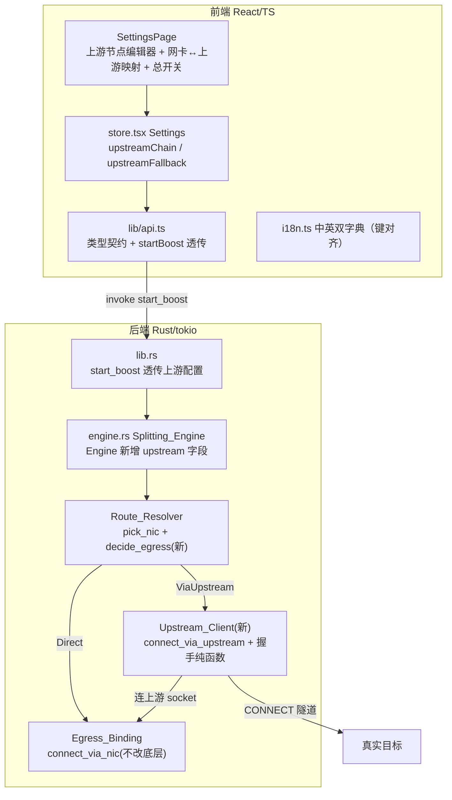
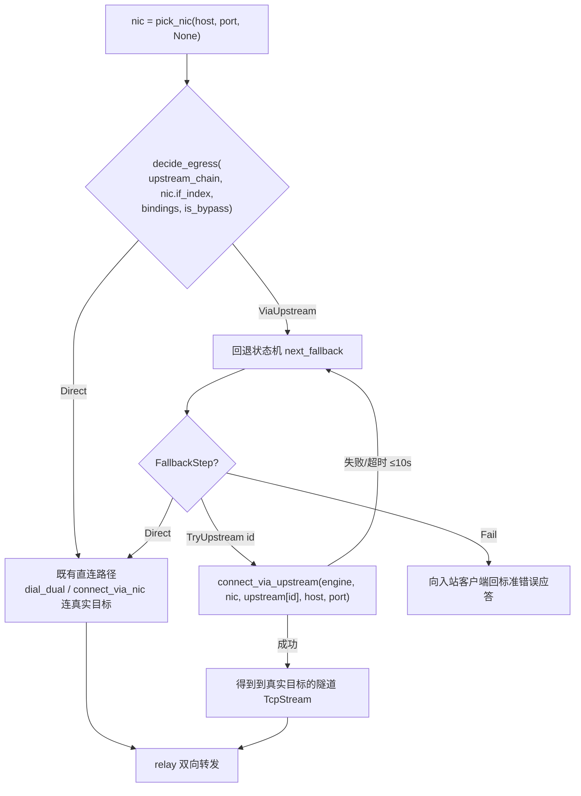
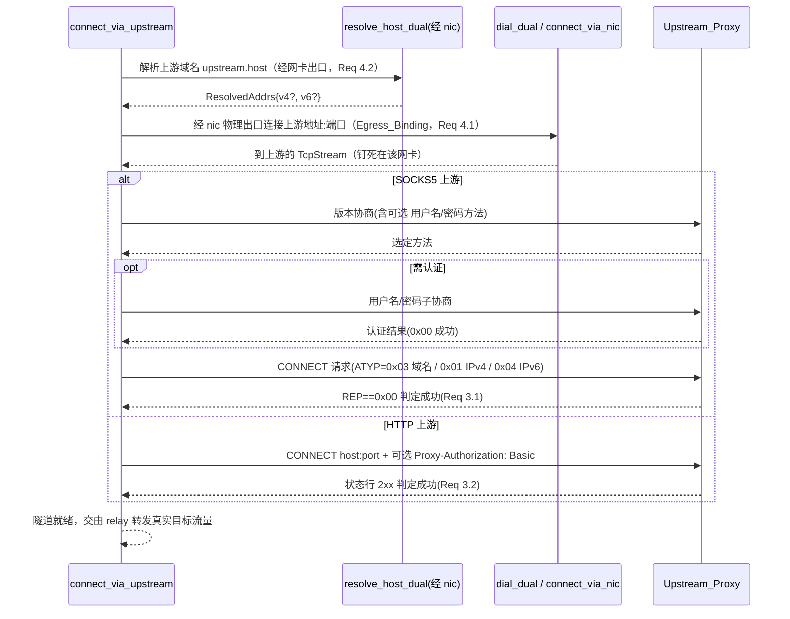

# Design Document

## Overview

本设计基于已确认的 `requirements.md`（9 条需求），为 HypoMuxPlus 增加**每网卡上游代理链 / 多节点聚合**能力：为每张参与聚合的物理网卡绑定一个（或多个）上游代理节点（`socks5` / `http`）；当一条下载连接被调度到某张网卡时，HypoMuxPlus 以该网卡的物理出口（Egress_Binding）先连上该网卡绑定的上游代理，再由上游经 CONNECT 隧道连接真实目标，从而让「网卡A→上游节点1」「网卡B→上游节点2」并行，同时突破本地最后一公里与单节点两个瓶颈。

设计的第一约束是**对既有直连聚合路径零破坏**（Req 5）：`connect_via_nic`、`pick_nic`、`resolve_host_dual`、`decide_rule_action`、`RouteRuleDef`、`dial_dual`、`handle_socks`/`handle_http` 的对外行为在总开关未启用时完全不变。上游能力以「在既有『选好网卡 → 连目标』步骤之间插入一个出口决策分派」的**叠加式**方式引入，而非替换任何既有函数。

核心手法：
- **复用 Egress_Binding**：到上游的 socket 与到真实目标的直连 socket 走同一条 `connect_via_nic(nic, dst)`（含 v4/v6 `IP_UNICAST_IF`/`IPV6_UNICAST_IF` 分派与源地址绑定），不改其底层实现（Req 4.1、4.5）。
- **上游握手纯函数化**：SOCKS5/HTTP CONNECT 的报文构造与解析、SOCKS5 用户名密码子协商、HTTP Basic 认证 Base64 编码全部抽为不依赖 IO 的纯函数，供 `proptest` round-trip 测试（Req 9）。
- **出口决策纯函数化**：`decide_egress`（走直连还是走上游）、`pick_upstream_for_nic`（一网卡多上游的调度选择）、`next_fallback`（回退策略状态机）均为纯函数，与 IO 拨号解耦。

技术栈沿用现状：Tauri 2 + Rust(tokio) 后端、React 19 + TypeScript 前端、`i18n.ts` 中英双字典、`proptest`（Rust）+ `vitest` + `fast-check`（前端）测试基建。

### 关键设计决策与依据

- **上游选择完全由承载网卡决定**（Req 7.2、边界）：不新增独立于既有规则体系的「按目标选上游」维度。既有 `pick_nic`（进程规则 > 域名规则 > 调度策略）先选出承载网卡，再由该网卡的 `Upstream_Binding` 决定走 Upstream_Route 还是 Direct_Aggregate。这样上游链天然继承既有 bypass、按网卡/进程规则、调度策略语义。
- **回环上游不叠加属用户配置责任**（Req 4 边界）：`127.0.0.1` 类上游无法叠加，不做特殊语义保证，仅在 UI 给出提示。
- **回退仅在同网卡上游集合内**（Req 6 边界）：`next_fallback` 只在同一网卡绑定的上游之间轮试，全部失败后按策略「回退直连」或「失败」，不跨网卡借用其他网卡的上游。
- **首版仅 TCP CONNECT**（Req 3 边界）：不实现 UDP over 上游、SOCKS5 UDP ASSOCIATE/BIND over 上游，不解析上游隧道内应用层载荷（端到端加密透传）。
- **不做订阅 / 自动测速 / 自动选路**（Req 1/2 边界）：节点由用户手工填写或简单文本导入；映射对象仅为网卡。
- **不自研 Base64 / proptest**：Base64 采用生态成熟实现（`base64` crate 或等价的最小内联标准实现，二选一在实现阶段确定），属性框架采用 `proptest`/`fast-check`。

## Architecture

### 系统分层与本次改动落点



### 出口决策与上游路由（本次核心）

既有 `handle_socks`/`handle_http` 的流程是「`pick_nic` 选网卡 → `dial_dual`/`connect_via_nic` 连真实目标 → `relay` 转发」。本次在「选好网卡」与「连真实目标」之间插入**出口决策分派**：



### 单条上游连接的建立（connect_via_upstream）



### 实现顺序与依赖

1. **阶段 A — 数据模型与透传（Req 1/2/8）**：定义 `UpstreamProxy`/`UpstreamBinding` 及 `upstream_chain`/`upstream_fallback`；`store.tsx` → `api.startBoost` → `start_boost` → `engine::start` 全链路透传；`Engine` 新增字段并在 `start` 解析绑定表。
2. **阶段 B — 上游握手纯函数（Req 3/9）**：`build/parse_socks5_connect_req`、`parse_socks5_connect_reply`、SOCKS5 用户名密码子协商 build/parse、`build_http_connect_req`、`parse_http_status_line`、`basic_auth_b64`。可独立单测，无 IO。
3. **阶段 C — 出口决策纯函数（Req 6/7/9）**：`pick_upstream_for_nic`、`decide_egress`、`next_fallback`。
4. **阶段 D — Upstream_Client 组装（Req 3/4）**：`connect_via_upstream` 复用 `resolve_host_dual` + `dial_dual`/`connect_via_nic` + 阶段 B 握手。
5. **阶段 E — 路由集成（Req 5/6/7）**：在 `handle_socks`/`handle_http` 的连接分派点接入 `decide_egress` + `next_fallback` 回退循环。
6. **阶段 F — 前端 UI（Req 8）**：上游节点编辑器、网卡↔上游映射、总开关、回退策略选择，中英对齐 + `aria-label`。
7. **阶段 G — 测试落地（Req 9）**：`proptest` 覆盖阶段 B/C；前端 `vitest`+`fast-check` 覆盖前端纯逻辑与 i18n 键对齐。

## Components and Interfaces

下列为模块级改动清单与关键接口签名（细化到函数签名级别）。标注 `[新增]`/`[泛化]`/`[不变]`。

### 1) `engine.rs` — 数据结构（Req 1/2/5）

```rust
// [新增] 上游代理条目。serde camelCase 与前端契约一致。
#[derive(Debug, Clone, Deserialize)]
#[serde(rename_all = "camelCase")]
pub struct UpstreamProxy {
    pub id: String,                    // Upstream_Id：同组唯一、稳定、不复用
    pub kind: String,                  // "socks5" | "http"
    pub host: String,                  // 域名或 IP（≤253 字符）
    pub port: u16,                     // 1..=65535
    #[serde(default)]
    pub username: Option<String>,      // 认证用户名（1..=255）；无认证则 None/空
    #[serde(default)]
    pub password: Option<String>,      // 认证密码（1..=255）
    #[serde(default)]
    pub label: String,                 // Upstream_Label（≤64），日志/UI 展示
}

// [新增] 网卡↔上游映射：一条 Upstream_Binding。
// 一对一为 upstreamIds.len()==1；一网卡多上游为 len()>1；多网卡共享同一 id 亦允许。
#[derive(Debug, Clone, Deserialize)]
#[serde(rename_all = "camelCase")]
pub struct UpstreamBinding {
    pub if_index: u32,                 // 网卡权威标识 IfIndex
    pub upstream_ids: Vec<String>,     // 该网卡绑定的上游 id 列表（引用 UpstreamProxy.id）
}

// [新增] 回退策略。
#[derive(Debug, Clone, Copy, PartialEq, Eq)]
pub(crate) enum FallbackPolicy { Direct, Fail }   // "direct" | "fail"
```

`Engine` 结构新增字段（未启用时不影响任何既有分支）：

```rust
pub struct Engine {
    // ... 既有字段全部 [不变] ...
    /// [新增] 上游代理链总开关（默认 false，Req 5.5）
    upstream_chain: bool,
    /// [新增] 上游条目表：id -> UpstreamProxy（start 阶段由 Vec 构建，便于 O(1) 引用）
    upstreams: HashMap<String, UpstreamProxy>,
    /// [新增] 网卡→上游 id 列表：if_index -> Vec<UpstreamId>（已剔除悬空引用，Req 2.6）
    upstream_bindings: HashMap<u32, Vec<String>>,
    /// [新增] 回退策略（默认 Direct）
    upstream_fallback: FallbackPolicy,
    /// [新增] 上游超时（缺省 ≤10s，Req 6.1）
    upstream_timeout: std::time::Duration,
}
```

### 2) `engine.rs` — 出口决策纯函数（Req 6/7/9）[新增]

```rust
// [新增] 出口决策结果：直连聚合 或 走某上游。
#[derive(Debug, Clone, PartialEq, Eq)]
pub(crate) enum Egress {
    Direct,                 // 既有 Direct_Aggregate 路径
    ViaUpstream(String),    // 经指定 Upstream_Id 的上游节点
}

// [新增-纯函数] 出口决策：给定总开关、承载网卡、绑定表与是否命中 bypass，
//   返回该连接应走直连还是走上游（走上游时返回“首选”上游 id）。
//   规则（Req 7）：
//     - 总开关关 => Direct（Req 5.1）
//     - 命中 bypass => Direct（Req 7.1，最高优先）
//     - 该网卡无 Upstream_Binding 或绑定为空 => Direct（Req 7.3）
//     - 否则 => ViaUpstream(pick_upstream_for_nic 选出的首个上游)（Req 7.4）
pub(crate) fn decide_egress(
    upstream_chain: bool,
    if_index: u32,
    bindings: &HashMap<u32, Vec<String>>,
    is_bypass: bool,
    sched_idx: usize,            // 该网卡多上游时的调度序号（复用既有调度序，Req 2.3）
) -> Egress

// [新增-纯函数] 一网卡多上游的调度选择：按调度序号在该网卡绑定的上游间取一个。
//   bindings[if_index] 为空或不存在 => None；len()==1 => 该唯一 id；
//   len()>1 => 依 sched_idx 轮转选取（sched_idx % len）。
pub(crate) fn pick_upstream_for_nic(
    bindings: &HashMap<u32, Vec<String>>,
    if_index: u32,
    sched_idx: usize,
) -> Option<String>

// [新增] 回退状态机的一步动作。
#[derive(Debug, Clone, PartialEq, Eq)]
pub(crate) enum FallbackStep {
    TryUpstream(String),    // 尝试该 Upstream_Id
    Direct,                 // 回退直连（policy=Direct 且上游全试尽）
    Fail,                   // 失败（policy=Fail 且上游全试尽）
}

// [新增-纯函数] 回退决策：给定“已尝试过的上游 id 集合”“该网卡全部上游 id（有序）”
//   与回退策略，返回下一步动作。
//   - 存在尚未尝试的上游 => TryUpstream(下一个未试的 id)（Req 6.2）
//   - 全部上游已试尽 且 policy=Direct => Direct（Req 6.3）
//   - 全部上游已试尽 且 policy=Fail => Fail（Req 6.4）
pub(crate) fn next_fallback(
    tried: &[String],
    nic_upstreams: &[String],
    policy: FallbackPolicy,
) -> FallbackStep
```

### 3) `engine.rs` — Upstream_Client（Req 3/4）[新增]

```rust
// [新增] 建立一条“经 nic 物理出口 → 上游 → 真实目标”的隧道。
//   步骤：1) 经 nic 解析上游域名（resolve_host_dual，Req 4.2）
//         2) 经 nic 物理出口 dial_dual/connect_via_nic 连上游（Egress_Binding，Req 4.1/4.5）
//         3) 按 upstream.kind 执行 SOCKS5 / HTTP CONNECT 握手（含可选认证）
//   整体受 engine.upstream_timeout 约束（Req 6.1）；任一步失败返回 Err 交由回退处理（Req 3.6/4.4）。
async fn connect_via_upstream(
    engine: &Engine,
    nic: &NicRuntime,
    upstream: &UpstreamProxy,
    host: &str,     // 真实目标主机（域名优先交上游解析，Req 3.5）
    port: u16,      // 真实目标端口
) -> std::io::Result<TcpStream>
```

#### SOCKS5 上游握手纯函数（Req 3.1/3.3/3.5/9.1/9.2）

```rust
// [新增-纯函数] 版本协商请求：VER(0x05) NMETHODS METHODS...
//   无认证 => [0x00]；有认证 => [0x00,0x02]（声明用户名/密码方法，Req 3.3）。
pub(crate) fn build_socks5_greeting(with_auth: bool) -> Vec<u8>
// [新增-纯函数] 解析服务端方法选择应答：VER METHOD -> 选定方法字节（0x00 无认证 / 0x02 认证 / 0xFF 拒绝）。
pub(crate) fn parse_socks5_method_reply(buf: &[u8]) -> Option<u8>

// [新增-纯函数] 用户名/密码子协商请求（RFC 1929）：VER(0x01) ULEN USER PLEN PASS。
pub(crate) fn build_socks5_userpass(username: &str, password: &str) -> Vec<u8>
// [新增-纯函数] 解析子协商应答：VER STATUS -> STATUS（0x00 成功）。
pub(crate) fn parse_socks5_userpass_reply(buf: &[u8]) -> Option<u8>

// [新增] SOCKS5 CONNECT 目标地址类型（复用既有 ATYP 语义）。
#[derive(Debug, Clone, PartialEq, Eq)]
pub(crate) enum ConnectTarget {
    V4(Ipv4Addr, u16),
    V6(Ipv6Addr, u16),
    Domain(String, u16),   // ATYP=0x03，域名交上游解析（Req 3.5）
}
// [新增-纯函数] CONNECT 请求：VER(0x05) CMD(0x01) RSV(0x00) ATYP ADDR PORT。
pub(crate) fn build_socks5_connect_req(target: &ConnectTarget) -> Vec<u8>
// [新增-纯函数] 解析 CONNECT 请求（与 build 互逆，供 round-trip 测试）。
pub(crate) fn parse_socks5_connect_req(buf: &[u8]) -> Option<ConnectTarget>
// [新增-纯函数] 解析 CONNECT 应答：VER REP RSV ATYP BND.ADDR BND.PORT
//   -> 返回 (rep, 消费字节数)；当且仅当 rep==0x00 判定成功（Req 3.1）。
pub(crate) fn parse_socks5_connect_reply(buf: &[u8]) -> Option<(u8, usize)>
```

#### HTTP 上游握手纯函数（Req 3.2/3.4/3.5/9.1/9.2）

```rust
// [新增-纯函数] CONNECT 请求行 + 头：
//   "CONNECT <host>:<port> HTTP/1.1\r\nHost: <host>:<port>\r\n"
//   + 可选 "Proxy-Authorization: Basic <b64>\r\n" + "\r\n"（Req 3.4/3.5）。
pub(crate) fn build_http_connect_req(host: &str, port: u16, auth: Option<(&str, &str)>) -> Vec<u8>
// [新增-纯函数] 解析响应状态行 "HTTP/1.x <code> <reason>" -> 状态码 u16；
//   当且仅当 2xx（含 200）判定成功（Req 3.2）。非法格式返回 None。
pub(crate) fn parse_http_status_line(line: &str) -> Option<u16>

// [新增-纯函数] HTTP Basic 认证：Base64("<user>:<pass>")（Req 3.4）。
pub(crate) fn basic_auth_b64(username: &str, password: &str) -> String
```

### 4) `engine.rs` — 路由集成点（Req 5/6/7）[泛化]

在 `handle_socks`/`handle_http` 既有「`pick_nic` 之后、连接真实目标之前」处插入统一分派。抽出一个内部辅助以避免在两个 handler 中重复回退循环：

```rust
// [新增] 出口分派 + 回退循环：根据 decide_egress 结果返回“到真实目标的可转发流”。
//   - Direct：走既有 dial_dual/connect_via_nic（行为与现状完全一致，Req 5.1/5.3）。
//   - ViaUpstream：以 next_fallback 驱动，在该网卡上游集合内逐个 connect_via_upstream；
//     全试尽后按 upstream_fallback 回退直连或返回错误（Req 6.2/6.3/6.4）。
//   每次上游失败/回退均记录含上游标签与原因的日志（Req 6.5）。
async fn establish_target(
    engine: &Engine,
    nic: &NicRuntime,
    host: &str,
    port: u16,
    literal_ip: Option<Ipv4Addr>,     // ATYP=0x01 字面 IPv4 直连路径（保持既有不变）
    dual_addrs: Option<&ResolvedAddrs>,
    is_bypass: bool,
) -> std::io::Result<TcpStream>
```

- **SOCKS5**（`handle_socks`）：三处连接点（ATYP=0x01 字面 IPv4、ATYP=0x04 IPv6、域名）统一改为经 `establish_target`。未启用上游 / 命中 bypass / 网卡无绑定时，`establish_target` 内部走既有 `connect_via_nic`/`dial_dual`，字节流与既有完全一致（Req 5.1/5.3/5.4）。
- **HTTP**（`handle_http`）：`connect_via_nic(&nic, SocketAddr::V4(dst))` 连接点改为经 `establish_target`。
- **is_bypass 传入**：既有 `pick_nic` 已内部处理规则，`establish_target` 额外需要「是否命中 bypass」以满足 Req 7.1（bypass 绝不走上游）。复用 `Engine::is_bypass(host)` 的结果传入。
- **调度序号 `sched_idx`**：一网卡多上游时的选择序（Req 2.3），复用既有连接计数（如 `nic.active` 或全局 `conn_id`）取模，保证多上游间轮转。

### 5) `lib.rs` — 命令透传（Req 1/2/8）[泛化]

```rust
// [泛化] start_boost 增加 upstreams / upstream_bindings / upstream_chain / upstream_fallback 透传
// [泛化] engine::start(...) 增加对应参数（见下）
```

### 6) `engine.rs` — `start` 签名扩展（Req 1/2/5）[泛化]

```rust
pub async fn start(
    app: AppHandle,
    selected: Vec<SelectedNic>,
    socks_port: u16,
    http_port: u16,
    strategy: String,
    lang: String,
    down_limit_mbps: f64,
    bypass: Vec<String>,
    rules: Vec<RouteRuleDef>,
    ip_version: String,
    udp_associate: bool,
    // [新增] 以下为上游代理链配置
    upstreams: Vec<UpstreamProxy>,
    upstream_bindings: Vec<UpstreamBinding>,
    upstream_chain: bool,
    upstream_fallback: String,          // "direct" | "fail"
) -> Result<EngineHandle, String>
```

`start` 内构建：`upstreams` Vec → `HashMap<id, UpstreamProxy>`；`upstream_bindings` → `HashMap<if_index, Vec<UpstreamId>>`，并**剔除引用了不存在条目的 id**（Req 2.6：被删除条目对应绑定视为未绑定）；`upstream_fallback` 经解析为 `FallbackPolicy`（未知值默认 `Direct`）。总开关默认 `false`（Req 5.5）。

### 7) 前端组件（Req 8）

- `lib/api.ts`[泛化]：新增 TS 类型 `UpstreamProxy`、`UpstreamBinding`；`startBoost` 增参数 `upstreams`、`upstreamBindings`、`upstreamChain`、`upstreamFallback`，`invoke("start_boost", {..., upstreams, upstreamBindings, upstreamChain, upstreamFallback})`。
- `store.tsx`[泛化]：`Settings` 增 `upstreamChain: boolean`（默认 `false`）、`upstreamFallback: "direct" | "fail"`（默认 `"direct"`）。上游条目列表与映射作为独立持久化状态（localStorage，见 Data Models），随 `App.tsx` 一并透传给 `startBoost`。
- `SettingsPage.tsx`[泛化]：新增「上游代理链」分区：
  - 总开关（`Switch` + `aria-label`）。
  - 上游节点编辑器（新增/编辑/删除，字段：类型 socks5/http、host、port、可选用户名/密码、label；含 Req 1.6 字段级校验与 Req 1.7 上限 128 提示）。
  - 网卡↔上游映射编辑器（每张聚合网卡下拉选择绑定的上游，可多选；共享映射允许）。
  - 回退策略选择（Segmented：回退直连 / 失败）。
  - 回环上游提示（host 为 `127.0.0.1`/`localhost` 时给出「无法叠加」提示，Req 4 边界）。
- `App.tsx`[泛化]：持久化上游节点列表与映射，`onBoost` 时并入 `startBoost` 调用。
- `i18n.ts`[泛化]：新增键中英同步（`upstreamTitle`/`upstreamHint`、`upstreamEnable`、`upstreamAddNode`、`upstreamKind`、`upstreamHost`/`upstreamPort`/`upstreamUser`/`upstreamPass`/`upstreamLabel`、`upstreamBinding`、`upstreamFallback`/`upstreamFallbackDirect`/`upstreamFallbackFail`、`upstreamLimitReached`、`upstreamInvalidHost`/`upstreamInvalidPort`/`upstreamInvalidKind`、`upstreamLoopbackWarn` 等）。

## Data Models

### 前后端类型契约（同步定义）

| 概念 | Rust（serde camelCase） | TypeScript（api.ts） |
| --- | --- | --- |
| 上游节点 | `UpstreamProxy { id, kind, host, port, username?, password?, label }` | `UpstreamProxy { id: string; kind: "socks5" \| "http"; host: string; port: number; username?: string; password?: string; label: string }` |
| 网卡↔上游映射 | `UpstreamBinding { if_index, upstream_ids }` | `UpstreamBinding { ifIndex: number; upstreamIds: string[] }` |
| 总开关 | `start(..., upstream_chain: bool)` | `startBoost(..., upstreamChain: boolean)` |
| 回退策略 | `start(..., upstream_fallback: String)` → `FallbackPolicy` | `startBoost(..., upstreamFallback: "direct" \| "fail")` |

### 透传路径（端到端）

```
store.tsx(Settings.upstreamChain / upstreamFallback + 上游节点/映射持久化状态)
  → App.tsx onBoost
  → api.startBoost(..., upstreams, upstreamBindings, upstreamChain, upstreamFallback)
  → invoke("start_boost", { ..., upstreams, upstreamBindings, upstreamChain, upstreamFallback })
  → lib.rs start_boost 命令
  → engine::start(..., upstreams, upstream_bindings, upstream_chain, upstream_fallback)
  → Engine{ upstreams: HashMap, upstream_bindings: HashMap, upstream_chain, upstream_fallback, upstream_timeout }
```

### 校验约束（Req 1）

| 字段 | 约束 | 违反时 |
| --- | --- | --- |
| `kind` | ∈ {`socks5`,`http`} | Settings_UI 拒绝保存并提示（Req 1.6） |
| `host` | 非空且 ≤253 字符 | 同上 |
| `port` | 1..=65535 | 同上 |
| `username`/`password` | 配置认证时各 1..=255 字符 | 同上（Req 1.5） |
| `label` | ≤64 字符 | 截断/提示 |
| 条目总数 | ≤128 | 达上限拒绝新增并提示（Req 1.7） |
| `id` | 同组唯一、稳定、不复用 | 前端生成（如 `crypto.randomUUID()`），删除后不重用（Req 1.8） |

### 前端持久化（localStorage）

```typescript
// 上游节点列表，key = "hmx-upstreams"
type UpstreamStore = UpstreamProxy[];               // 上限 128
// 网卡↔上游映射，key = "hmx-upstream-bindings"
type UpstreamBindingStore = UpstreamBinding[];      // ifIndex -> upstreamIds
// 总开关与回退策略并入既有 Settings（store.tsx）：upstreamChain / upstreamFallback
```

删除一条上游节点时，前端同步从所有 `UpstreamBinding.upstreamIds` 中移除该 id；后端 `start` 亦对悬空引用做二次剔除（Req 2.6，双保险）。

### 悬空引用与未绑定语义（Req 2.6 / 7.3）

- `upstream_bindings` 构建时过滤掉 `upstreams` 中不存在的 id；过滤后 `upstream_ids` 为空的网卡等价于「未绑定上游」。
- `decide_egress` 对「无绑定 / 绑定为空」的网卡一律返回 `Direct`（Req 7.3）。

## Correctness Properties

*A property is a characteristic or behavior that should hold true across all valid executions of a system—essentially, a formal statement about what the system should do. Properties serve as the bridge between human-readable specifications and machine-verifiable correctness guarantees.*

下列属性由验收标准经 prework 分析提炼而来。端到端建连、`connect_via_nic` 的 Win32 `setsockopt`/`bind`、真实 DNS/网卡解析、UI 交互与持久化等 IO/集成项归入 Testing Strategy 的集成/冒烟与人工实机验证，不列为属性。经属性反思去除冗余后（域名目标并入 CONNECT round-trip；零回归/分流协同合并为单条 `decide_egress`；一网卡多上游/共享映射合并为单条 `pick_upstream_for_nic`；回退三分支合并为单条 `next_fallback`），保留以下互不重叠的属性。

### Property 1: SOCKS5 CONNECT 请求构造/解析 round-trip 与健壮性

*For any* CONNECT 目标（IPv4 / IPv6 / 域名 + 端口），`build_socks5_connect_req` 构造的字节序列经 `parse_socks5_connect_req` 应还原出等价的目标（含域名原样、端口一致，ATYP 类型正确）；且*for any* 任意字节序列，`parse_socks5_connect_req` 绝不 panic（非法或截断输入返回 `None`）。

**Validates: Requirements 3.1, 3.5, 3.6, 9.1, 9.2**

### Property 2: SOCKS5 CONNECT 应答 REP 判定

*For any* 合法的 SOCKS5 CONNECT 应答字节（VER REP RSV ATYP BND.ADDR BND.PORT），`parse_socks5_connect_reply` 返回的 `rep` 等于应答中的 REP 字段，且「隧道成功」的判定当且仅当 `rep == 0x00`；*for any* 截断/非法应答返回 `None`（不误判成功）。

**Validates: Requirements 3.1, 3.6**

### Property 3: SOCKS5 用户名/密码子协商 round-trip 与认证声明

*For any* 用户名与密码（长度 1..=255），`build_socks5_userpass` 构造的子协商请求可被解析还原为同一用户名与密码；`parse_socks5_userpass_reply` 对 `STATUS==0x00` 判定认证成功、非零判定失败；且 `build_socks5_greeting(true)` 声明的方法列表包含用户名/密码方法 `0x02`，`build_socks5_greeting(false)` 不包含 `0x02`。

**Validates: Requirements 3.3, 9.2**

### Property 4: HTTP CONNECT 请求行构造 round-trip

*For any* 目标 host 与端口（及可选认证），`build_http_connect_req` 生成的请求首行形如 `CONNECT <host>:<port> HTTP/1.1`，从中解析出的 host 与 port 等于输入；当提供认证时请求头恰含一行 `Proxy-Authorization: Basic <b64>`，未提供时不含该头。

**Validates: Requirements 3.2, 3.5, 9.1, 9.2**

### Property 5: HTTP 状态行解析与 2xx 判定

*For any* 合法状态行 `HTTP/1.x <code> <reason>`，`parse_http_status_line` 返回的状态码等于 `<code>`，且「隧道成功」判定当且仅当状态码 ∈ [200,299]；*for any* 非法/畸形状态行返回 `None`（不误判成功）。

**Validates: Requirements 3.2, 3.6**

### Property 6: HTTP Basic 认证 Base64 round-trip

*For any* 用户名与密码，`basic_auth_b64(user, pass)` 的输出经标准 Base64 解码后等于字节串 `"<user>:<pass>"`。

**Validates: Requirements 3.4**

### Property 7: 一网卡上游选择综合正确性（pick_upstream_for_nic）

*For any* 绑定表、网卡 `if_index` 与调度序号 `sched_idx`：当该网卡无绑定或绑定列表为空时返回 `None`；当绑定列表非空时返回值必属于该列表；当列表长度为 1 时恒返回该唯一 id；当长度 > 1 时，遍历连续的 `sched_idx` 能覆盖列表中的每一个 id（轮转全覆盖）；不同 `if_index` 指向同一 id 的共享映射均能各自正确选出该 id。

**Validates: Requirements 2.2, 2.3, 2.4, 9.3**

### Property 8: 悬空上游引用剔除

*For any* 上游条目 id 全集与网卡绑定引用集合，构建后的 `upstream_bindings` 中不含任何不属于全集的 id（悬空引用被剔除）；所有引用了存在条目的绑定均被保留；剔除后 `upstream_ids` 为空的网卡等价于未绑定。

**Validates: Requirements 2.6**

### Property 9: 出口决策综合正确性（decide_egress）

*For any* 总开关状态、网卡 `if_index`、绑定表与 `is_bypass` 标志：当总开关为 `false` 时结果恒为 `Direct`（零回归，Req 5.1）；当 `is_bypass == true` 时结果恒为 `Direct`（bypass 最高优先，Req 7.1）；当总开关为 `true`、非 bypass、且该网卡存在非空绑定时结果为 `ViaUpstream(id)` 且 `id` 属于该网卡绑定集合（Req 5.2/7.4）；当总开关为 `true`、非 bypass、但该网卡无绑定/空绑定时结果为 `Direct`（Req 5.3/7.3）。

**Validates: Requirements 5.1, 5.2, 5.3, 7.1, 7.2, 7.3, 7.4**

### Property 10: 回退决策综合正确性（next_fallback）

*For any* 已尝试上游 id 集合 `tried`、该网卡全部上游 id 有序列表 `nic_upstreams` 与回退策略 `policy`：当 `nic_upstreams` 中存在未出现在 `tried` 的 id 时，返回 `TryUpstream(下一个未尝试的 id)`（Req 6.2）；当全部上游均已尝试且 `policy == Direct` 时返回 `Direct`（Req 6.3）；当全部上游均已尝试且 `policy == Fail` 时返回 `Fail`（Req 6.4）。

**Validates: Requirements 6.2, 6.3, 6.4, 9.4**

### Property 11: 上游条目校验综合正确性（validateUpstream）

*For any* 上游条目输入（随机 host 长度、端口值、类型字符串、可选认证），前端校验函数 `validateUpstream` 通过当且仅当：`host` 非空且长度 ≤253、`port ∈ [1,65535]`、`kind ∈ {socks5,http}`、（若配置认证）用户名与密码长度均 ∈ [1,255]；任一条件违反时校验失败并标记出对应的失败字段。

**Validates: Requirements 1.2, 1.6, 9.6**

### Property 12: i18n 中英字典键集合完全一致

*For any* 语言字典键，中文字典 `zh` 与英文字典 `en` 的键集合相等（对称差为空），上游代理链相关的全部新增文案键在两侧均存在。

**Validates: Requirements 8.5, 9.6**

## Error Handling

设计遵循「Fail-Fast + 局部降级不断网」的既有风格，并严格保证总开关未启用时对既有路径零破坏。

- **上游握手失败 / 应答非法（Req 3.6）**：所有 `parse_socks5_connect_reply`、`parse_socks5_method_reply`、`parse_socks5_userpass_reply`、`parse_http_status_line` 对截断/畸形输入返回 `None`（绝不 panic）；`connect_via_upstream` 据此返回 `Err`，交由回退循环处理，不影响其他连接。
- **上游超时（Req 6.1）**：`connect_via_upstream` 整体（物理建连 + 握手）受 `engine.upstream_timeout`（缺省 ≤10s）约束，`tokio::time::timeout` 包裹；超时视为本次不可用并进入 `next_fallback`。
- **同网卡多上游回退（Req 6.2）**：回退循环维护 `tried` 集合，`next_fallback` 依次给出未尝试上游；每次失败记录含 `upstream.label` 与失败原因的可读日志（Req 6.5），中英文随界面语言。
- **回退直连 / 失败（Req 6.3/6.4）**：全部上游试尽后，`FallbackPolicy::Direct` 走既有 `dial_dual`/`connect_via_nic` 直连真实目标；`FallbackPolicy::Fail` 向入站客户端返回标准 SOCKS5（`REP=0x05` 或对应错误）/ HTTP（如 `502`）失败应答，复用既有错误应答分支。
- **网卡无对应地址族源地址（Req 4.4）**：`connect_via_nic` 的 IPv6 分支在无全局 IPv6 源地址时返回 `AddrNotAvailable`；`connect_via_upstream` 记录可读日志后返回 `Err`，进入回退。
- **悬空上游引用（Req 2.6）**：`start` 构建绑定表时剔除不存在的 id；`decide_egress` 对空绑定网卡返回 `Direct`，绝不指向不存在的上游。
- **回环上游（Req 4 边界）**：不阻断（用户配置责任），仅前端在 host 为回环时给出「无法叠加」提示；后端照常经网卡出口尝试连接（回环连接不经物理网卡属预期，不做特殊处理）。
- **前端**：`validateUpstream` 校验失败时保留用户输入并高亮失败字段（Req 1.6）；达 128 上限时禁用新增并提示（Req 1.7）；删除条目时同步清理映射引用（Req 2.6）。invoke 失败经既有 `toast("error", ...)` 反馈。

## Testing Strategy

采用单元测试 + 属性测试 + 集成/冒烟/人工实机的分层策略。属性测试覆盖上文 12 条 Correctness Properties；示例单测覆盖具体分支与边界；集成/冒烟与人工实机覆盖真实 socket、Egress_Binding 系统调用、真实上游握手、UI 持久化等 IO。

### 可测性重构（服务 Req 9，实现前置）

将上游握手报文构造/解析与出口/回退决策从含 socket/AppHandle 的函数中析出为不依赖 IO 的纯函数：
- `engine.rs`（上游握手）：`build_socks5_greeting`、`parse_socks5_method_reply`、`build/parse_socks5_userpass`、`parse_socks5_userpass_reply`、`build/parse_socks5_connect_req`、`parse_socks5_connect_reply`、`build_http_connect_req`、`parse_http_status_line`、`basic_auth_b64`。
- `engine.rs`（决策）：`pick_upstream_for_nic`、`decide_egress`、`next_fallback`，以及绑定表悬空引用剔除函数（如 `sanitize_bindings(upstreams, bindings)`）。
- `connect_via_upstream` 仅做「解析 + 拨号 + 调用上述纯函数写/读字节」的薄封装，真实 socket 交互不进入自动化测试。
- 前端：`validateUpstream`、上游节点/映射的纯处理逻辑（如删除条目时清理映射引用）析出到可导入模块（如 `lib/upstream.ts`）。

### Rust 后端测试（Req 9.1–9.5）

- 位置：`engine.rs` 内 `#[cfg(test)] mod tests`。
- 属性测试库：`proptest`（dev-dependency，成熟标准），**不自研属性框架**。每条属性一个 `proptest!`，最少 100 次迭代（`ProptestConfig { cases: 100, .. }`）。
- 每个属性测试以注释标注：`// Feature: nic-upstream-proxy-chain, Property N: <property text>`。
- 覆盖映射（Rust 侧）：
  - Property 1/2 → `build/parse_socks5_connect_req` round-trip + 随机 rep 判定 + 随机字节健壮性。
  - Property 3 → `build/parse_socks5_userpass` round-trip + `build_socks5_greeting` 认证声明。
  - Property 4/5 → `build_http_connect_req` 请求行 round-trip + `parse_http_status_line` 随机三位码判定与畸形健壮性。
  - Property 6 → `basic_auth_b64` 经标准 Base64 解码还原 `user:pass`。
  - Property 7 → `pick_upstream_for_nic`（空=>None、单一=>唯一、多个=>轮转全覆盖且 ∈ 集合、共享映射）。
  - Property 8 → `sanitize_bindings` 悬空引用剔除。
  - Property 9 → `decide_egress`（开关关恒 Direct、bypass 恒 Direct、有绑定非 bypass => ViaUpstream ∈ 集合、无绑定 => Direct）。
  - Property 10 → `next_fallback`（有未试=>下一个未试、试尽+Direct=>Direct、试尽+Fail=>Fail）。
- 依赖注入：`upstream_timeout` 等时间相关逻辑参数化，纯函数不触碰真实时钟/网络，使 `cargo test` 独立于 GUI 与网络（Req 9.7）。
- 边界（Req 9 边界）：不对 `connect_via_upstream`、`connect_via_nic`、真实上游握手写自动化测试——由人工实机验证。

### 前端测试（Req 9.6）

- 复用既有 `vitest` + `jsdom` + `fast-check`，每属性 ≥100 次（`fc.assert(..., { numRuns: 100 })`）。
- 覆盖映射（前端侧）：
  - Property 11 → `validateUpstream`：`fast-check` 生成随机 host 长度 / 端口 / 类型 / 认证组合，断言校验结果与失败字段标记正确（含 host 超 253、端口越界、类型非法、认证长度越界）。
  - Property 12 → i18n 键对齐：导入 `i18n.ts` 的 zh/en 字典，断言键集合相等（对称差为空），覆盖上游相关新增键。
  - 上游删除 => 映射引用清理的纯逻辑：`fast-check`/示例断言删除后无悬空引用。
- 边界（Req 9 边界）：不测依赖 Tauri `invoke` 的运行时集成路径，不做端到端 UI 渲染快照。

### 集成 / 冒烟 / 人工实机（不适合 PBT 的验收项）

以下验收项以 1–3 个代表性示例或人工实机验证清单覆盖，不进入属性测试：

- **真实上游握手**：分别用真实 `socks5`（带/不带认证）与 `http`（带/不带 Basic 认证）上游，验证 CONNECT 隧道建立成功、能拉取真实目标数据（Req 3.1/3.2/3.3/3.4）。
- **网卡绑定与物理出口**：多网卡各绑定不同上游，实机抓包 / 上游侧观察确认「网卡A→上游1」「网卡B→上游2」经各自物理出口而非回环，并行叠加带宽（Req 4.1/4.3/4.5）。
- **上游域名解析经网卡**：上游 host 填域名，确认经所选网卡出口解析并建连（Req 4.2）。
- **系统调用/地址族回退**：为绑定上游的网卡制造无对应地址族源地址场景，确认记录日志并回退（Req 4.4）。
- **回退实机验证**：故意配置不可用上游，验证 ≤10s 超时后按「回退直连」直连成功、按「失败」返回错误应答（Req 6.1/6.3/6.4），日志含上游标签（Req 6.5）。
- **零回归**：总开关关闭时，既有直连聚合 / bypass / 按网卡·进程规则 / 调度策略 / 限速 / fake-ip / IPv4·IPv6·TCP·DNS 路径行为与升级前一致（Req 5.1/5.4/5.5/7.5）——跑既有测试套件 + 人工回归。
- **持久化与 UI**：上游条目增删改、映射编辑、总开关切换的持久化与列表刷新（Req 1.3/1.4/2.1/2.5/8.1/8.2/8.3/8.4）；`aria-label` 存在性（Req 8.6）；128 上限提示（Req 1.7）；id 唯一稳定不复用（Req 1.8）。

### 中英同步与无障碍（跨切面）

上游代理链相关全部新增 UI 文案在 `i18n.ts` 中英双字典严格对齐，由 Property 12 的键对齐测试守护；新增交互元素延续既有无障碍规范（`aria-label`、`role=dialog`、`aria-live`）。

### 验收项 → 测试类型对照总表

| 需求 | 验收项 | 测试类型 |
| --- | --- | --- |
| 1.2/1.6 | 上游条目校验 | Property 11（前端 fast-check） |
| 1.1/1.3/1.4/1.5/1.7/1.8 | 持久化 / 上限 / id | 前端示例 + 人工 |
| 2.2/2.3/2.4 | 一网卡多上游 / 共享映射选择 | Property 7（proptest） |
| 2.6 | 悬空引用剔除 | Property 8（proptest） |
| 2.1/2.5 | 映射持久化 / 运行期生效 | 集成 + 人工 |
| 3.1/3.5/3.6 | SOCKS5 CONNECT 请求 | Property 1（proptest） |
| 3.1/3.6 | SOCKS5 CONNECT 应答判定 | Property 2（proptest） |
| 3.3 | SOCKS5 认证子协商 | Property 3（proptest） |
| 3.2/3.5 | HTTP CONNECT 请求行 | Property 4（proptest） |
| 3.2/3.6 | HTTP 状态行 2xx 判定 | Property 5（proptest） |
| 3.4 | HTTP Basic 认证 Base64 | Property 6（proptest） |
| 3.1–3.4 端到端 | 真实上游握手 | 集成（1–3 例）+ 人工 |
| 4.1/4.2/4.3/4.4/4.5 | Egress_Binding / 物理出口 | 集成 + 人工实机 |
| 5.1/5.2/5.3/7.1/7.2/7.3/7.4 | 出口决策 / 零回归 / 分流协同 | Property 9（proptest） |
| 5.4/5.5/7.5 | 既有路径回归 / 默认关 | 既有套件 + 冒烟 + 人工 |
| 6.2/6.3/6.4 | 回退决策 | Property 10（proptest） |
| 6.1/6.5 | 超时 / 回退日志 | 集成 + 人工 |
| 8.5 | i18n 键对齐 | Property 12（vitest） |
| 8.1/8.2/8.3/8.4/8.6 | 配置 UI / 无障碍 | 前端示例 + 人工 |
| 9.1–9.4/9.6 | 纯函数属性测试存在性 | 由上述 Property 满足 |
| 9.5/9.7 | 迭代数 / 注释 / 独立性 | 测试配置（≥100 次 + 注释 + 纯函数化） |
