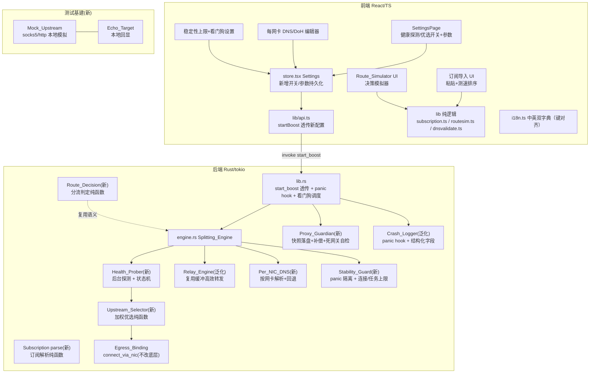
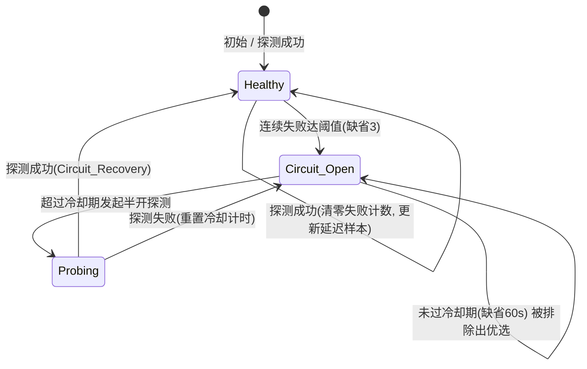
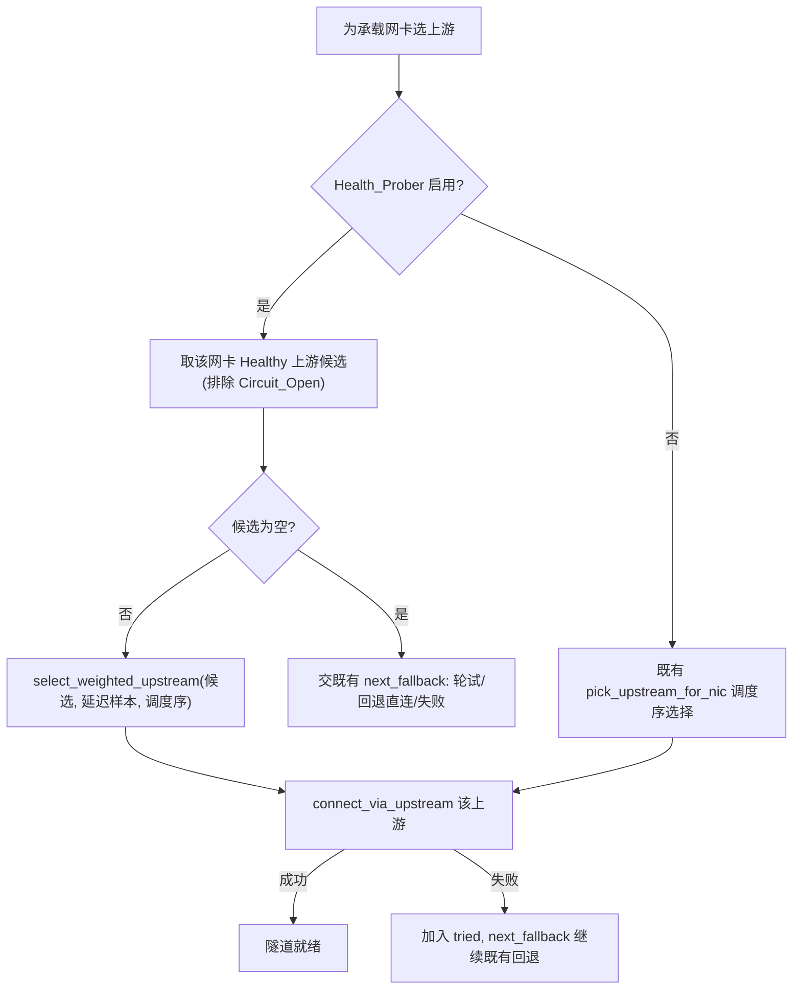
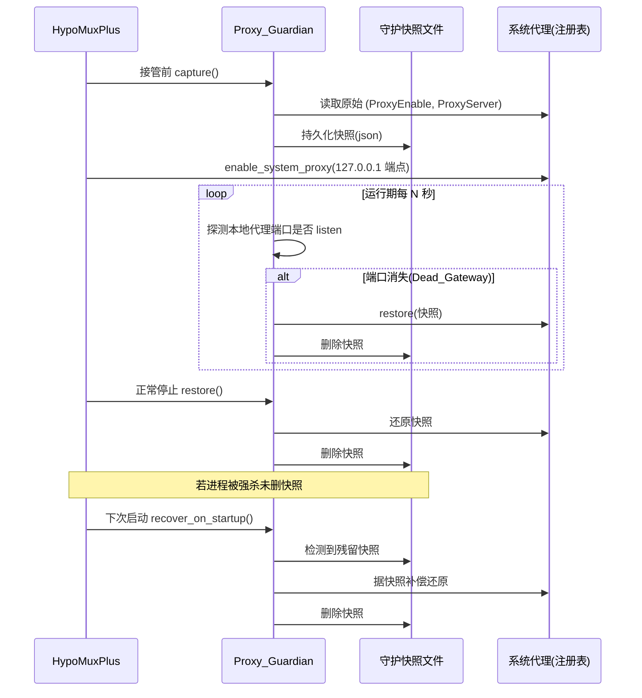
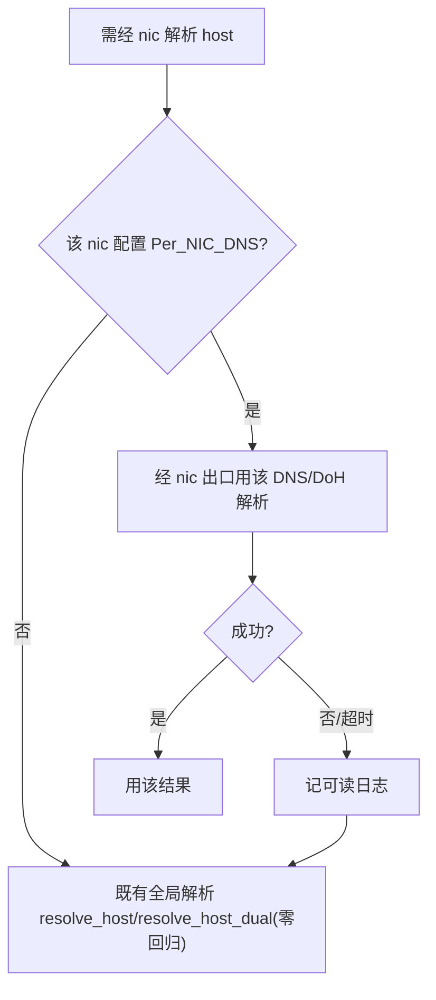
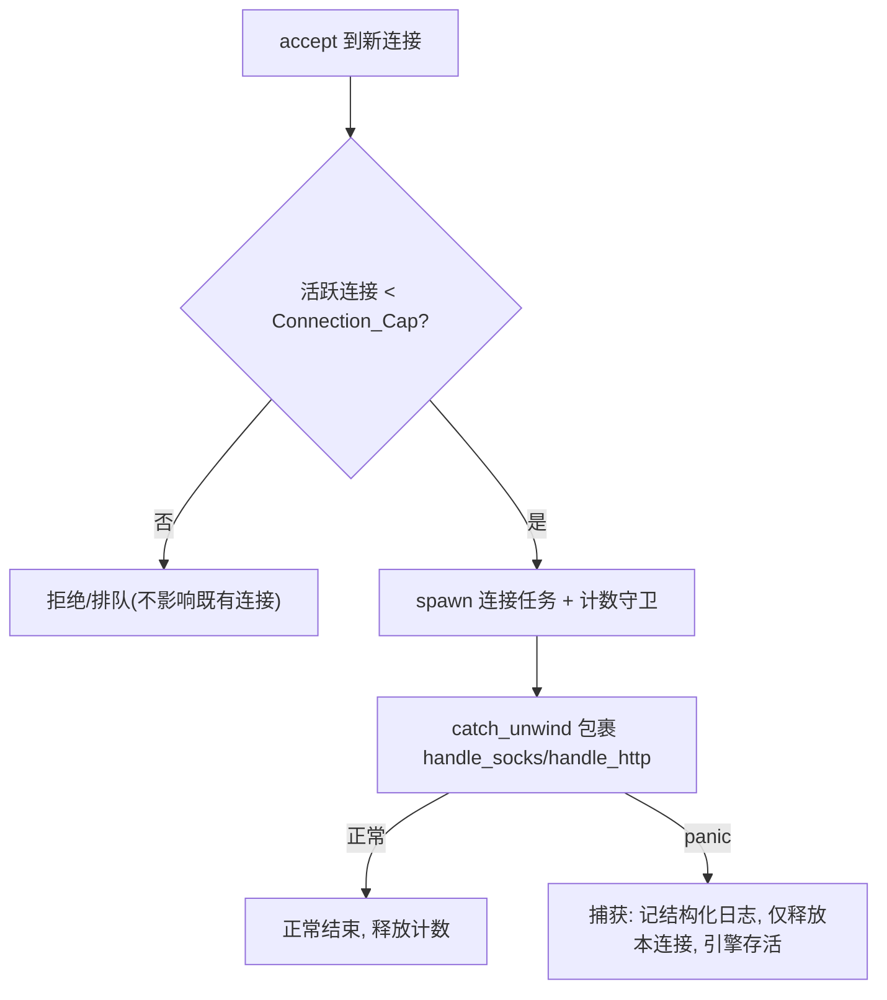

# Design Document

## Overview

本设计基于已确认的 `requirements.md`（13 条需求），为 HypoMuxPlus 引入一组**专业化差异化与稳定性加固**能力，在既有「每网卡上游代理链 / 多节点聚合」（`nic-upstream-proxy-chain`）之上，补齐上游智能优选、分流可视化、订阅导入、系统代理防泄漏、高效转发、每网卡 DNS/DoH、运行时稳定性加固、结构化崩溃日志，以及把大量原「必须人工」的验收项转为本地 mock 端到端自动化测试。

设计遵循与既有 spec 一致的三条第一原则：

- **对既有能力零回归（Req 13）**：本次每项能力都以「默认关闭 / 默认旁路」引入。未启用时，`engine.rs`（Splitting_Engine）的既有直连聚合、上游代理链、bypass、按进程/域名规则、调度策略、限速、fake-ip、DoH、双栈 IPv6、UDP ASSOCIATE、诊断与聚合测速的代码路径与字节流完全不变。
- **核心逻辑纯函数化（Req 11）**：健康状态机、上游加权优选、订阅解析、分流决策计算、各类输入校验均抽为不依赖 IO 的纯函数，供 `proptest` / `vitest`+`fast-check` 属性测试；真实探测拨号、注册表读写、mock 服务器等 IO 作薄封装与纯逻辑分离。
- **诚实的验证边界**：真实多物理网卡叠加、真实公网节点握手、GUI 渲染归人工实机验证；本次新增的本地 mock 端到端测试仅在 `127.0.0.1` 上运行、不依赖真实公网与真实网卡。

### 关键设计决策与依据

- **panic 隔离与 release profile（Req 8）**：当前 `Cargo.toml` 的 `[profile.release]` 为 `panic = "abort"`，此配置下任意 panic 会立即中止整个进程，与「单连接 panic 不得打垮引擎」矛盾。本设计将 release profile 改为 `panic = "unwind"`，使 tokio 每条连接任务（`tauri::async_runtime::spawn`）的 panic 仅结束该任务而不波及引擎；并在连接处理入口以 `FutureExt::catch_unwind` 兜底记录结构化日志。这是本次唯一的编译配置变更，代价是二进制体积略增，换取稳定性质变。防御性上仍坚持既有「解析一律返回 `Option`/`Result`、不 `unwrap` 外部数据」的风格，使 panic 成为极端兜底而非常态。
- **系统代理快照持久化（Req 5）**：既有 `sysproxy.rs` 的 `SAVED_PROXY` 是进程内内存态，主进程被强杀 / 崩溃即丢失，无法在下次启动补偿还原。本设计新增「快照落盘」：接管前把原始快照（`ProxyEnable` / `ProxyServer`）写入 `app_config_dir` 下的守护文件；正常还原后删除该文件；下次启动若检测到残留守护文件即据此补偿还原。运行期以定时自检探测本地代理端口存活性，判定 Dead_Gateway 后还原。既有 `clear_residual_proxy` 的「疑似本程序残留清空」行为保留为兜底。
- **上游选择完全由承载网卡决定（沿用既有架构）**：健康探测与加权优选只发生在「同一网卡绑定的多个上游之间」，不新增「按目标选上游」维度。优选结果仍交由既有 `next_fallback` 回退循环驱动，保证与既有回退语义无缝协同。
- **订阅解析不引入 YAML 重依赖**：Clash 订阅只需从 `proxies:` 列表提取 `type ∈ {socks5, http}` 的少数字段（name/server/port/username/password）。为避免引入维护状态不佳的 YAML crate 且保证「对任意畸形输入不 panic」完全可控，采用**最小内联解析器**（面向 Clash proxies 段的行式解析 + 分享链接解析 + base64 预解码），纯函数、逐条容错跳过。不实现完整 Clash 规则引擎与非 socks5/http 协议转发。
- **高效转发以「保持语义 + 复用缓冲」为准（Req 6）**：既有 `relay` 已为每方向使用一次性分配的 64KiB 复用缓冲（非每包分配），本设计将其形式化为不变量并做微优化（缓冲尺寸常量化、明确半关闭与资源释放顺序），严格保持逐字节等价与既有令牌桶限速语义；不引入平台特有零拷贝系统调用（tokio 在 Windows 无稳定 splice 等价），避免破坏限速与遥测口径。
- **每网卡 DNS 旁路式接入（Req 7）**：在既有 `resolve_host` / `resolve_host_dual` 之前插入「该网卡是否配置 Per_NIC_DNS」的判定；配置了则经该网卡出口用指定 DNS/DoH 解析，失败回退既有全局解析路径；未配置则完全走既有路径（零回归）。

技术栈沿用现状：Tauri 2 + Rust(tokio) 后端、React 19 + TypeScript 前端、`i18n.ts` 中英双字典、`proptest`（Rust）+ `vitest` + `fast-check`（前端）。

## Architecture

### 系统分层与本次改动落点



### 健康探测状态机（Health_Prober，Req 1）



纯函数 `health_transition(cur, event, cfg, now)` 描述上述迁移；后台探测任务只负责「按间隔拨号 + 记录成功/失败/延迟」，把状态迁移委托给纯函数，从而可被属性测试完全覆盖。

### 加权优选 + 回退协同（Upstream_Selector，Req 2）



优选只改变「首选哪个上游」，实际建连与失败后续仍走既有 `establish_target` + `next_fallback` 循环，回退终止语义（回退直连 / 失败）完全不变。

### 系统代理防泄漏看门狗生命周期（Proxy_Guardian，Req 5）



### 每网卡 DNS 解析回退（Per_NIC_DNS，Req 7）



### panic 隔离（Stability_Guard，Req 8）



## Components and Interfaces

下列为模块级改动清单与关键接口签名（函数签名级）。标注 `[新增]`/`[泛化]`/`[不变]`。可测核心逻辑均为不依赖 IO 的纯函数。

### 1) `engine.rs` — 健康探测数据结构与状态机（Req 1）[新增]

```rust
// [新增] 单个上游的健康状态。
#[derive(Debug, Clone, Copy, PartialEq, Eq)]
pub(crate) enum HealthState {
    Healthy,
    CircuitOpen,   // 熔断，暂时排除出优选候选
}

// [新增] 单个上游的健康度量（纯数据，可 Clone）。
#[derive(Debug, Clone, PartialEq)]
pub(crate) struct UpstreamHealth {
    pub state: HealthState,
    pub consecutive_failures: u32,       // 连续失败计数
    pub last_latency_ms: Option<u64>,    // 最近一次成功探测延迟
    pub opened_at_ms: Option<u64>,       // 进入熔断的时间戳(ms since epoch)
}

impl Default for UpstreamHealth { /* Healthy, 0, None, None */ }

// [新增] 健康探测配置（均可配置，带缺省）。
#[derive(Debug, Clone, Copy)]
pub(crate) struct HealthConfig {
    pub enabled: bool,                   // 默认 false（Req 1.7）
    pub interval_ms: u64,                // 探测间隔，缺省 30_000
    pub timeout_ms: u64,                 // 探测超时，缺省 5_000（≤5s）
    pub fail_threshold: u32,             // 熔断阈值，缺省 3
    pub cooldown_ms: u64,                // 冷却期，缺省 60_000
}

// [新增] 探测事件（喂给状态机的输入）。
#[derive(Debug, Clone, Copy, PartialEq, Eq)]
pub(crate) enum ProbeEvent { Success(u64 /*latency_ms*/), Failure }

// [新增-纯函数] 健康状态机迁移（Req 1.2/1.3/1.5）。无 IO，可完全属性测试。
//   - Success => Healthy, 失败计数清零, 更新 last_latency_ms。
//   - Failure 且 consecutive_failures+1 >= fail_threshold => CircuitOpen, 记 opened_at_ms=now。
//   - Failure 未达阈值 => 保持 Healthy, 失败计数+1。
//   - CircuitOpen 下的 Success（半开探测成功）=> Healthy（Circuit_Recovery）。
pub(crate) fn health_transition(
    cur: UpstreamHealth,
    event: ProbeEvent,
    cfg: HealthConfig,
    now_ms: u64,
) -> UpstreamHealth;

// [新增-纯函数] 冷却期判定：CircuitOpen 且 now - opened_at >= cooldown 时应发起半开探测。
pub(crate) fn should_half_open(h: &UpstreamHealth, cfg: HealthConfig, now_ms: u64) -> bool;

// [新增-纯函数] 该上游当前是否可作为优选候选（Healthy，或到期可半开视为候选）。
pub(crate) fn is_selectable(h: &UpstreamHealth, cfg: HealthConfig, now_ms: u64) -> bool;
```

`Engine` 结构新增字段（未启用时不影响既有分支）：

```rust
pub struct Engine {
    // ... 既有字段 [不变] ...
    /// [新增] 健康探测配置（enabled 默认 false）
    health_cfg: HealthConfig,
    /// [新增] 上游健康表：Upstream_Id -> UpstreamHealth（后台探测任务维护）
    upstream_health: Arc<Mutex<HashMap<String, UpstreamHealth>>>,
    /// [新增] 每网卡 DNS 配置：if_index -> PerNicDns（空表示未配置）
    per_nic_dns: HashMap<u32, PerNicDns>,
    /// [新增] 稳定性上限
    conn_cap: usize,     // Connection_Cap，默认合理上限（如 4096）
    task_cap: usize,     // Task_Cap，默认合理上限（如 64）
    /// [新增] 活跃连接计数（用于 Connection_Cap 与遥测复用）
    active_conns: Arc<AtomicI64>,
}
```

### 2) `engine.rs` — 上游加权优选（Upstream_Selector，Req 2）[新增]

```rust
// [新增-纯函数] 在候选上游中按延迟加权优选（Req 2.1/2.6）。
//   - candidates: 该网卡绑定的、当前 is_selectable 的上游 id 有序列表（已排除熔断）。
//   - latencies: 对应候选的最近延迟样本（None 视为较大延迟基值）。
//   - sched_idx: 复用既有调度序，做确定性打散避免所有连接挤向同一节点。
//   返回值恒为 candidates 中的一员；candidates 为空返回 None。
//   加权：权重 ∝ 1/(latency+base)，延迟越低权重越高；用 sched_idx 在加权分布上确定性取样。
pub(crate) fn select_weighted_upstream(
    candidates: &[String],
    latencies: &[Option<u64>],
    sched_idx: usize,
) -> Option<String>;

// [泛化] establish_target 的上游首选来源：Health_Prober 启用时改用
//   「候选过滤(is_selectable) + select_weighted_upstream」，否则维持既有 pick_upstream_for_nic。
//   其余（next_fallback 回退循环、tried 集合、回退直连/失败）完全不变。
```

### 3) `engine.rs` — 每网卡 DNS/DoH（Per_NIC_DNS，Req 7）[新增/泛化]

```rust
// [新增] 每网卡 DNS 配置。
#[derive(Debug, Clone)]
pub(crate) struct PerNicDns {
    pub kind: DnsKind,      // Plain(明文 UDP DNS) | Doh(DoH URL)
    pub endpoint: String,   // "1.1.1.1" 或 "https://dns.google/dns-query"
}
#[derive(Debug, Clone, Copy, PartialEq, Eq)]
pub(crate) enum DnsKind { Plain, Doh }

// [新增-纯函数] 校验 DNS 端点（明文 IP 或 https DoH URL），非法返回失败字段（Req 7.5）。
pub(crate) fn validate_dns_endpoint(kind: DnsKind, endpoint: &str) -> bool;

// [泛化] resolve_host / resolve_host_dual 入口前插入：
//   若 per_nic_dns.get(nic.if_index) 存在 => 经该 DNS/DoH 解析（复用既有 DoH/UDP 拨号骨架，
//   经该 nic 的 IP_UNICAST_IF 出口）；失败/超时 => 记日志并回退既有全局解析路径。
//   未配置 => 直接走既有路径（零回归，Req 7.3/7.6）。
```

### 4) `engine.rs` — 高效转发（Relay_Engine，Req 6）[泛化]

```rust
// [泛化] relay 保持既有「每方向一次性分配 64KiB 复用缓冲 + 半关闭」的结构，
//   将缓冲尺寸常量化为 RELAY_BUF_BYTES，明确资源释放顺序，保持逐字节等价与
//   既有 RateLimiter 下行限速语义、遥测统计口径完全不变（Req 6.3/6.4/6.5）。
const RELAY_BUF_BYTES: usize = 65536;
```

### 5) `engine.rs` — 稳定性加固（Stability_Guard，Req 8）[新增/泛化]

```rust
// [泛化] accept_loop 派发连接前检查 active_conns < conn_cap；超限则不 spawn（拒绝该连接），
//   既有活跃连接不受影响（Req 8.2）。spawn 后以 RAII 守卫增/减 active_conns。
// [新增] 连接处理以 catch_unwind 兜底（依赖 release panic=unwind）：
//   单连接 panic 被捕获、记结构化日志、仅释放本连接资源，引擎与其他连接存活（Req 8.1/8.4）。
// [泛化] 后台任务（探测/测速）经 Task_Cap 信号量限制并发派发（Req 8.3）。
```

### 6) `subscription.rs`（新模块）— 订阅解析纯函数（Req 4）[新增]

```rust
// [新增] 解析结果：受支持候选 + 被忽略计数。
#[derive(Debug, Clone, PartialEq)]
pub(crate) struct ImportResult {
    pub candidates: Vec<UpstreamProxy>,   // 仅 socks5/http
    pub ignored_unsupported: usize,       // 非 socks5/http 或畸形被跳过计数
}

// [新增-纯函数] 顶层解析：自动识别 base64 正文 / Clash YAML / 分享链接集合。
//   对任意字节输入不 panic（Req 4.8）；无受支持节点返回空候选（Req 4.5）。
pub(crate) fn parse_subscription(input: &str) -> ImportResult;

// [新增-纯函数] base64 正文预解码（失败则原样返回，交后续按明文尝试，Req 4.2）。
pub(crate) fn try_base64_decode(input: &str) -> Option<String>;

// [新增-纯函数] Clash YAML 的 proxies 段最小提取：仅取 type∈{socks5,http} 的
//   name/server/port/username/password（Req 4.3）；其他类型计入 ignored。
pub(crate) fn parse_clash_proxies(yaml: &str) -> ImportResult;

// [新增-纯函数] 单条分享链接解析：socks5://[user:pass@]host:port#name /
//   http(s) 代理链接 => 候选；ss://、vmess://、trojan://、hysteria:// 等 => ignored。
pub(crate) fn parse_share_link(line: &str) -> Option<UpstreamProxy>;
```

前端镜像纯逻辑（供 UI 即时预览与测试）：`src/lib/subscription.ts` 导出等价的 `parseSubscription(input): { candidates: UpstreamProxy[]; ignoredUnsupported: number }`（前端解析用于预览，最终以后端解析为准或二者一致）。

### 7) `engine.rs` — 分流决策计算（Route_Decision / Route_Simulator，Req 3）[新增]

后端提供纯函数（复用既有 `decide_rule_action` / `decide_egress` / `pick_upstream_for_nic` 语义），前端提供等价纯逻辑做即时展示：

```rust
// [新增] 模拟输出。
#[derive(Debug, Clone, PartialEq, Eq)]
pub(crate) struct RouteDecision {
    pub bypass_hit: bool,
    pub matched_rule: MatchedRule,       // Process(name) | Domain(pattern) | None(调度回退)
    pub nic_if_index: Option<u32>,       // 承载网卡（bypass 命中时 None）
    pub via_upstream: Option<String>,    // 走上游时选中的上游 id/label；直连为 None
}

// [新增-纯函数] 依据当前 bypass/规则/映射计算 Route_Decision（Req 3.1/3.2/3.3/3.4/3.6）。
//   与 Route_Resolver 优先级严格一致：bypass 最高 > 进程规则 > 域名规则 > 调度策略。
pub(crate) fn compute_route_decision(
    upstream_chain: bool,
    bypass: &[String],
    rules_proc: &[(String, RuleAction)],
    rules_nic: &[(String, u32)],
    bindings: &HashMap<u32, Vec<String>>,
    host: &str,
    port: u16,
    proc_name: Option<&str>,
    chosen_if_index: u32,   // 由调度策略预选的承载网卡（模拟时给定或取首个存活网卡）
    sched_idx: usize,
) -> RouteDecision;
```

前端 `src/lib/routesim.ts`：`validateSimInput(host, port)` 输入校验（Req 3.5）+ `formatRouteDecision(...)` 展示映射；前端亦可携带当前配置以纯 TS 复算展示，语义与后端一致。

### 8) `proxyguardian.rs`（新模块）— 防泄漏看门狗（Req 5）[新增]，配合 `sysproxy.rs`[泛化]

```rust
// [新增] 落盘快照结构（json）。
#[derive(Debug, Clone, Serialize, Deserialize)]
pub(crate) struct ProxySnapshot { pub enable: u32, pub server: String }

// [新增] 接管前捕获并落盘快照（Req 5.1）。
pub(crate) fn capture_and_persist(dir: &Path) -> std::io::Result<()>;
// [新增] 正常还原 + 删除快照文件（Req 5.2）。
pub(crate) fn restore_and_clear(dir: &Path);
// [新增] 启动补偿：检测残留快照则据其还原（Req 5.3）。
pub(crate) fn recover_on_startup(dir: &Path);
// [新增-纯函数] 死网关判定：给定「代理端点端口」与「该端口是否仍在监听」判定是否 Dead_Gateway。
pub(crate) fn is_dead_gateway(proxy_enabled: bool, port_listening: bool) -> bool;
// [新增] 运行期定时自检任务：探测本地端口存活，Dead_Gateway 则 restore（Req 5.4）。
//   还原失败按最大次数重试并记日志（Req 5.5）。
```

`sysproxy.rs`[泛化]：`enable_system_proxy` 调用 `proxyguardian::capture_and_persist`；`disable_system_proxy` 调用 `restore_and_clear`；既有内存快照与 `looks_like_ours` / `clear_residual_proxy` 保留为兜底。所有端点仅 `127.0.0.1`（Req 5.7）。

### 9) `logger.rs` — 结构化崩溃日志（Crash_Logger，Req 9）[泛化]

```rust
// [泛化] 复用既有 format_log_line/redact/滚动/LogLevel。新增结构化字段渲染：
//   format_structured(ts, level, subsystem, msg) -> String  // [新增-纯函数]
//   例："[ts] [ERROR] [Health_Prober] <redacted msg>"
// [新增] 进程级 panic hook（在 lib.rs run() 中 std::panic::set_hook 安装）：
//   捕获未处理 panic 的位置/消息/回溯摘要，经 redact 脱敏后写入崩溃日志文件；
//   写盘失败降级为既有 emit("hmx-log")（Req 9.5/9.6）。
```

### 10) `lib.rs` — 命令与生命周期透传（Req 1/5/7/8/9）[泛化]

```rust
// [泛化] start_boost 增参：health_cfg / per_nic_dns / conn_cap / task_cap / proxy_guardian_on。
// [泛化] engine::start 增对应参数并构建 Engine 新字段；未配置时全部取默认（关闭/旁路）。
// [泛化] setup() 安装 panic hook + proxyguardian::recover_on_startup。
// [泛化] cleanup()/stop_boost 调用 proxyguardian::restore_and_clear。
```

### 11) 前端组件（Req 12）[泛化/新增]

- `lib/api.ts`[泛化]：`startBoost` 增参 `healthCfg`、`perNicDns`、`connCap`、`taskCap`、`proxyGuardian`；新增类型 `PerNicDnsCfg`、`HealthCfg`。
- `store.tsx`[泛化]：`Settings` 增上述开关/参数（全部默认关闭/旁路值）；每网卡 DNS 映射（key `hmx-per-nic-dns`）与订阅草稿独立持久化。
- `SettingsPage.tsx`[泛化]：新增分区——健康探测与优选、订阅导入（粘贴 + 解析预览 + 一键测速排序 + 确认并入）、每网卡 DNS/DoH、稳定性上限与防泄漏看门狗；新增「分流决策模拟器」分区。
- `lib/subscription.ts` / `lib/routesim.ts` / `lib/dnsvalidate.ts`[新增]：纯逻辑（解析/校验/展示），供 vitest+fast-check。
- `i18n.ts`[泛化]：新增全部文案键，`zh`/`en` 严格对齐。

## Data Models

### 前后端类型契约（同步定义）

| 概念 | Rust（serde camelCase） | TypeScript（api.ts / store.tsx） |
| --- | --- | --- |
| 健康探测配置 | `HealthConfig { enabled, interval_ms, timeout_ms, fail_threshold, cooldown_ms }` | `HealthCfg { enabled: boolean; intervalMs: number; timeoutMs: number; failThreshold: number; cooldownMs: number }` |
| 每网卡 DNS | `PerNicDns { kind: "plain"\|"doh", endpoint }`（按 if_index 映射） | `PerNicDnsCfg { ifIndex: number; kind: "plain"\|"doh"; endpoint: string }` |
| 稳定性上限 | `start(..., conn_cap: usize, task_cap: usize)` | `startBoost(..., connCap: number, taskCap: number)` |
| 看门狗开关 | `start(..., proxy_guardian: bool)` | `startBoost(..., proxyGuardian: boolean)` |
| 上游候选（订阅导入） | `UpstreamProxy`（沿用 nic-upstream-proxy-chain） | `UpstreamProxy`（沿用） |
| 导入结果 | `ImportResult { candidates, ignored_unsupported }` | `{ candidates: UpstreamProxy[]; ignoredUnsupported: number }` |
| 分流判定 | `RouteDecision { bypass_hit, matched_rule, nic_if_index, via_upstream }` | 前端等价结构用于展示 |

### 透传路径（端到端）

```
store.tsx(Settings: healthCfg / connCap / taskCap / proxyGuardian + per-nic-dns 持久化)
  → App.tsx onBoost
  → api.startBoost(..., healthCfg, perNicDns, connCap, taskCap, proxyGuardian)
  → invoke("start_boost", { ..., healthCfg, perNicDns, connCap, taskCap, proxyGuardian })
  → lib.rs start_boost
  → engine::start(..., health_cfg, per_nic_dns, conn_cap, task_cap, proxy_guardian)
  → Engine{ health_cfg, upstream_health, per_nic_dns, conn_cap, task_cap, active_conns }
```

### 前端持久化（localStorage）

```typescript
// 每网卡 DNS 映射，key = "hmx-per-nic-dns"
type PerNicDnsStore = PerNicDnsCfg[];        // ifIndex -> {kind, endpoint}
// 健康/优选、上限、看门狗开关并入既有 Settings（store.tsx）
// 订阅导入草稿为一次性输入，不长期持久化（仅确认后并入 hmx-upstreams）
```

### 校验约束

| 字段 | 约束 | 违反时 |
| --- | --- | --- |
| `intervalMs` / `timeoutMs` / `cooldownMs` | 正整数，`timeoutMs ≤ intervalMs`，缺省 30000/5000/60000 | UI 拒绝并提示 |
| `failThreshold` | ≥1，缺省 3 | UI 拒绝并提示 |
| Per_NIC_DNS `endpoint` | `plain`: 合法 IPv4/IPv6；`doh`: `https://` URL | UI 拒绝并提示（Req 7.5） |
| `connCap` / `taskCap` | 正整数，设合理默认（如 4096 / 64） | UI 归一到默认 |
| 模拟器 host | 非空；port ∈ [1,65535] | 拒绝模拟并提示（Req 3.5） |
| 导入候选并入 | 沿用 128 上限与既有 UpstreamProxy 字段校验 | 超限拒绝并提示（Req 4.7） |

### 默认值（保证零回归，Req 13.1）

- `HealthConfig.enabled = false`（未启用时全部上游视为 Healthy，走既有 `pick_upstream_for_nic`）。
- `per_nic_dns` 为空映射（全部网卡走既有全局解析）。
- `proxy_guardian` 默认可启用但其「正常路径」行为与既有 `enable/disable_system_proxy` 等价，仅新增落盘/补偿旁路。
- `conn_cap`/`task_cap` 取足够大的默认值，正常负载下不触发（对既有路径无影响）。
- 高效转发为既有 `relay` 的等价形式化，无开关、恒等价。

## Correctness Properties

*A property is a characteristic or behavior that should hold true across all valid executions of a system.*

下列属性经 prework 提炼、互不重叠。真实探测拨号、注册表读写、真实 socket 与 GUI 归 Testing Strategy 的端到端 mock / 人工实机，不列为属性。

### Property 1: 健康状态机迁移正确性（health_transition）

*For any* 当前健康度量、探测事件、配置与时刻：`Success` 恒使状态为 `Healthy` 且连续失败计数归零并更新延迟样本；`Failure` 使失败计数 +1，当且仅当计数达到 `fail_threshold` 时进入 `CircuitOpen` 并记录 `opened_at_ms`；处于 `CircuitOpen` 的 `Success`（半开探测成功）恒恢复为 `Healthy`。函数对任意输入不 panic。

**Validates: Requirements 1.2, 1.3, 1.5**

### Property 2: 冷却期与半开判定（should_half_open / is_selectable）

*For any* `CircuitOpen` 度量与配置：`should_half_open` 为真当且仅当 `now - opened_at ≥ cooldown`；`is_selectable` 对 `Healthy` 恒为真、对未过冷却期的 `CircuitOpen` 恒为假、对已过冷却期的 `CircuitOpen` 为真（允许半开纳入）。

**Validates: Requirements 1.4, 2.6**

### Property 3: 上游加权优选恒在候选集内且排除熔断（select_weighted_upstream）

*For any* 候选列表、延迟样本与调度序：候选为空时返回 `None`；候选非空时返回值必属于候选列表；延迟更低者被选中的长期权重更高（对固定延迟分布，遍历连续 `sched_idx` 的选择分布偏向低延迟候选）；已被过滤掉的熔断上游不可能出现在结果中（由调用方传入的候选已排除熔断，函数不引入集合外元素）。

**Validates: Requirements 2.1, 2.6**

### Property 4: 订阅解析健壮性与 round-trip（parse_subscription / parse_share_link）

*For any* 任意字节字符串输入，`parse_subscription` 绝不 panic 且 `ignored_unsupported ≥ 0`；*for any* 由受支持（socks5/http）节点构造并序列化为分享链接 / Clash proxies 条目的输入，解析可还原等价的 `UpstreamProxy`（host/port/kind/可选认证一致）；非 socks5/http 协议节点不出现在 `candidates` 且被计入 `ignored_unsupported`。

**Validates: Requirements 4.1, 4.2, 4.3, 4.4, 4.8**

### Property 5: 分流决策与 Route_Resolver 语义一致（compute_route_decision）

*For any* bypass / 进程规则 / 域名规则 / 上游映射与目标：命中 bypass 时 `bypass_hit==true` 且 `via_upstream==None`；未命中 bypass 时优先级严格为「进程规则 > 域名规则 > 调度回退」，且「走上游 vs 直连」的判定与 `decide_egress` 对同一输入的结果一致（总开关关 / 无绑定 => 直连；否则走上游且 `via_upstream` ∈ 该网卡绑定集合）。

**Validates: Requirements 3.2, 3.3, 3.4, 3.6**

### Property 6: DNS 端点校验正确性（validate_dns_endpoint）

*For any* `kind` 与 `endpoint`：`plain` 通过当且仅当 `endpoint` 是合法 IPv4/IPv6 地址；`doh` 通过当且仅当 `endpoint` 是 `https://` 且主机段非空的 URL；其余一律不通过。

**Validates: Requirements 7.5**

### Property 7: 死网关判定（is_dead_gateway）

*For any* `(proxy_enabled, port_listening)`：判定为 `Dead_Gateway` 当且仅当 `proxy_enabled == true && port_listening == false`。

**Validates: Requirements 5.4**

### Property 8: 结构化日志与脱敏（format_structured + redact）

*For any* 时间戳、级别、子系统名与消息：`format_structured` 输出同时包含时间戳、级别标签、子系统名与消息子串；经 `redact` 后本机 IPv4 后两段、IPv6 前缀外、`C:\Users\<name>\` 用户名段均被掩码（复用既有 `redact` 属性，扩展覆盖子系统字段）。

**Validates: Requirements 9.1, 9.2, 9.3**

### Property 9: 模拟器输入校验（validateSimInput，前端）

*For any* host 与 port：通过当且仅当 host 非空且 port ∈ [1,65535]；违反标记对应失败。

**Validates: Requirements 3.5**

### Property 10: i18n 中英字典键集合完全一致

*For any* 语言字典键，`zh` 与 `en` 键集合相等（对称差为空），本次全部新增文案键在两侧均存在。

**Validates: Requirements 12.4**

> 补齐说明：本 spec 的 Testing Strategy 亦补齐 `nic-upstream-proxy-chain` 中标注为可选（`*`）而尚未落地的属性测试（SOCKS5 CONNECT round-trip、CONNECT 应答 REP 判定、HTTP CONNECT 请求行、HTTP 状态行 2xx、Base64 round-trip、pick_upstream_for_nic、sanitize_bindings、decide_egress、next_fallback、validateUpstream、i18n 键对齐），对应 Req 11 的「补齐既有可选属性测试」。

## Error Handling

遵循「Fail-Fast + 局部降级不断网」的既有风格，严格保证未启用新能力时对既有路径零破坏。

- **健康探测失败（Req 1）**：探测拨号超时/失败仅喂给 `health_transition` 记为 `Failure`，达阈值熔断；探测任务本身的任何 IO 错误被吞并记日志，绝不 panic、不影响连接处理。未启用时不派发探测任务。
- **优选与回退协同（Req 2）**：优选只影响首选上游；建连失败一律回落既有 `next_fallback` 循环（轮试剩余、回退直连或失败），终止语义不变。候选全熔断等价于「无可选上游」，直接进入既有回退。
- **订阅解析畸形（Req 4）**：`parse_subscription` 对任意输入不 panic；无法识别的行/节点逐条跳过并计入 `ignored_unsupported`；解析不出受支持节点返回空候选 + 提示。base64 解码失败则按明文重试。
- **每网卡 DNS 失败（Req 7）**：Per_NIC_DNS 解析超时/失败记可读日志并回退既有全局 DNS/DoH 路径，绝不因自定义 DNS 失败导致解析总失败。
- **看门狗还原失败（Req 5）**：`restore` 失败记含原因日志并重试至可配置最大次数；启动补偿在快照文件损坏时安全跳过（不阻断启动）；仅操作 `127.0.0.1` 端点。
- **panic 隔离（Req 8）**：连接处理以 `catch_unwind` 兜底（release `panic=unwind`），单连接 panic 被捕获、记结构化日志、仅释放本连接；`Connection_Cap`/`Task_Cap` 超限时拒绝/延迟新增而非崩溃。
- **崩溃日志写盘失败（Req 9）**：`Crash_Logger` 写盘失败静默降级为既有 `emit("hmx-log")`，不阻断主流程；panic hook 内的任何错误都不得再次 panic。
- **前端**：各配置项非法时保留输入并高亮失败字段；invoke 失败经既有 `toast("error", ...)` 反馈。

## Testing Strategy

分层：纯函数属性测试（proptest / vitest+fast-check）+ 本地 mock 端到端集成测试 + 人工实机。

### 可测性重构（服务 Req 11，实现前置）

将下列逻辑析出为无 IO 纯函数：`health_transition` / `should_half_open` / `is_selectable`（健康状态机）、`select_weighted_upstream`（加权优选）、`parse_subscription` 及其子函数（订阅解析）、`compute_route_decision`（分流判定）、`validate_dns_endpoint` / `is_dead_gateway` / `format_structured`（校验与日志）。前端 `subscription.ts` / `routesim.ts` / `dnsvalidate.ts` 析出等价纯逻辑。探测拨号、注册表读写、mock 服务器等 IO 作薄封装，不进入属性测试。

### Rust 后端测试（Req 11.1–11.4, 11.6）

- 位置：各模块 `#[cfg(test)] mod tests`。库：`proptest`（dev-dependency，已存在）。每属性 `ProptestConfig { cases: 100, .. }`，注释 `// Feature: pro-differentiation-and-hardening, Property N`。
- 覆盖：Property 1（health_transition）、2（冷却/半开）、3（加权优选∈候选且排熔断）、4（订阅解析 round-trip + 不 panic）、5（compute_route_decision 与 decide_egress/优先级一致）、6（validate_dns_endpoint）、7（is_dead_gateway）、8（format_structured + redact）。

### 端到端本地 mock 集成测试（Req 10）

- 位置：`src-tauri/tests/`（集成测试）或 `engine.rs` 的 `#[cfg(test)]`，用 `#[tokio::test]`。
- **Mock_Upstream**：tokio 监听 `127.0.0.1:0`（随机端口），可选 `socks5` / `http` 模式；可配置「要求认证 / 不要求」。要求认证时：正确凭据 => 握手成功；错误凭据 => 失败；**未提供任何凭据 => 视为有效认证尝试并允许成功**（Req 10.4 澄清）。
- **Echo_Target**：tokio 监听 `127.0.0.1:0`，将隧道内收到的字节原样回写。
- 用例：
  1. `connect_via_upstream` 经 Mock_Upstream(socks5/http，含/不含认证) 到 Echo_Target 写入随机字节 → 断言逐字节回读相等（握手+转发，Req 10.3）。
  2. 认证：正确/错误/无凭据三态断言（Req 10.4）。
  3. `establish_target` + `next_fallback`：首个 Mock_Upstream 拒连、次选可用 → 断言回退到次选成功（Req 10.5）。
  4. 全部上游不可用：回退策略 Direct → 断言直连 Echo_Target 成功；策略 Fail → 断言返回错误（Req 10.6）。
- **网络独立性（Req 10.7/10.8）**：全部端到端仅绑定 `127.0.0.1`，不触达真实公网；任何对真实网络资源的依赖视为测试失败（不以「碰巧可用」为通过）。`cargo test` 与 `vitest --run` 需两者均独立成功才视为满足 Req 11.7。

### 前端测试（Req 11.5, 12.4）

- `vitest` + `jsdom` + `fast-check`，每属性 ≥100 次。
- 覆盖：`parseSubscription`（round-trip + 不抛异常）、`validateDnsEndpoint`、`validateSimInput`（Property 9）、i18n 键对齐（Property 10）。

### 补齐既有可选属性测试（Req 11）

补齐 `nic-upstream-proxy-chain` 中标 `*` 未落地的属性测试：Property 1（SOCKS5 CONNECT round-trip）、2（CONNECT 应答 REP）、4（HTTP CONNECT 请求行）、5（HTTP 状态行 2xx）、6（Base64 round-trip）、7（pick_upstream_for_nic）、8（sanitize_bindings）、9（decide_egress）、10（next_fallback）、11（validateUpstream）、12（i18n 键对齐），统一带本 spec 的 Feature 注释或保留原 Feature 注释并纳入 CI。

### 集成 / 人工实机（不适合自动化）

- 真实公网 socks5/http 上游握手与真实多物理网卡并行叠加带宽（Req 边界）。
- Proxy_Guardian 在真实强杀 / 崩溃后的启动补偿还原（可半自动：模拟残留快照文件后启动验证补偿逻辑）。
- Per_NIC_DNS 经真实网卡出口解析（真实 setsockopt/bind）。
- 高效转发的真实 CPU 下降对比。
- GUI 渲染、持久化与交互、`aria-label` 存在性。

### 验收项 → 测试类型对照总表

| 需求 | 验收项 | 测试类型 |
| --- | --- | --- |
| 1.2/1.3/1.5 | 健康状态机迁移 | Property 1（proptest） |
| 1.4/2.6 | 冷却/半开/候选筛选 | Property 2/3（proptest） |
| 1.1/1.6/1.7/1.8 | 探测调度/默认关/日志 | 集成 + 人工 |
| 2.1/2.6 | 加权优选∈候选且排熔断 | Property 3（proptest） |
| 2.2/2.3/2.4/2.5 | 回退协同/未启用一致 | 端到端 mock + proptest |
| 3.2/3.3/3.4/3.6 | 分流判定语义一致 | Property 5（proptest） |
| 3.5 | 模拟器输入校验 | Property 9（vitest） |
| 3.1 | 模拟器展示 | 人工 |
| 4.1/4.2/4.3/4.4/4.8 | 订阅解析 | Property 4（proptest）+ 前端 |
| 4.5/4.6/4.7 | 空结果/测速排序/并入上限 | 集成 + 人工 |
| 5.1/5.2/5.3 | 快照落盘/还原/补偿 | 半自动（残留快照）+ 人工 |
| 5.4 | 死网关判定 | Property 7（proptest） |
| 5.5/5.6/5.7 | 还原重试/正常路径/仅本地 | 集成 + 人工 |
| 6.1–6.5 | 高效转发语义/限速/遥测 | 逐字节等价单测 + 人工 CPU 对比 |
| 7.5 | DNS 端点校验 | Property 6（proptest/vitest） |
| 7.1/7.2/7.3/7.4/7.6 | 每网卡解析/回退/零回归 | 集成 + 人工 |
| 8.1/8.4 | panic 隔离 | 端到端（注入 panic 的 mock handler）+ 单测 |
| 8.2/8.3/8.5/8.6 | 上限保护/无影响 | 单测 + 集成 |
| 9.1/9.2/9.3 | 结构化日志 + 脱敏 | Property 8（proptest） |
| 9.4/9.5/9.6 | 滚动/降级/前端面板不变 | 复用既有 + 单测 |
| 10.1–10.8 | 端到端 mock | 集成（tokio 本地 mock） |
| 11.1–11.8 | 属性测试存在性/独立性 | 由上述 Property + 配置满足 |
| 12.4 | i18n 键对齐 | Property 10（vitest） |
| 12.1/12.2/12.3/12.5 | 配置 UI/持久化/无障碍 | 前端示例 + 人工 |
| 13.1/13.2/13.3/13.4/13.5/13.6 | 零回归/默认关/仅本地/既有不变 | 既有套件 + 端到端 + 人工回归 |

### 中英同步与无障碍（跨切面）

本次全部新增 UI 文案在 `i18n.ts` 中英双字典严格对齐（Property 10 守护）；新增交互元素延续既有 `aria-label` / `role=dialog` / `aria-live` 规范。
