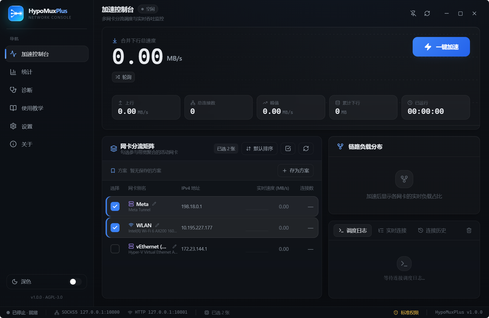
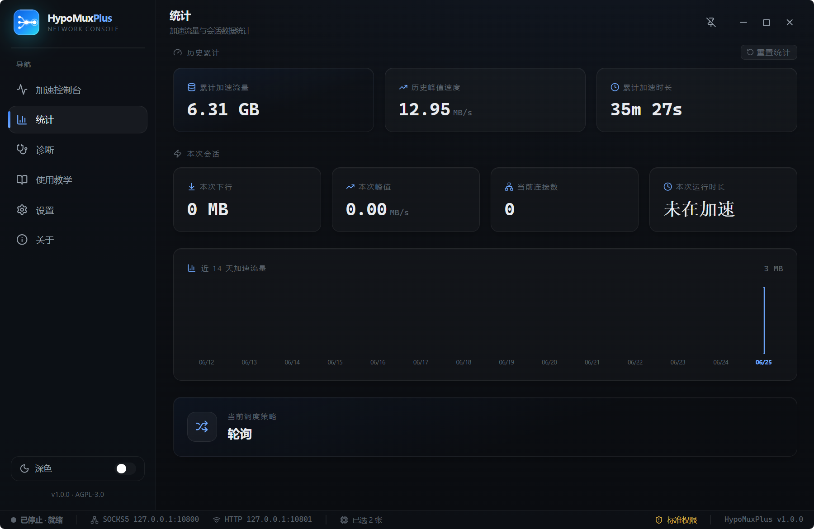
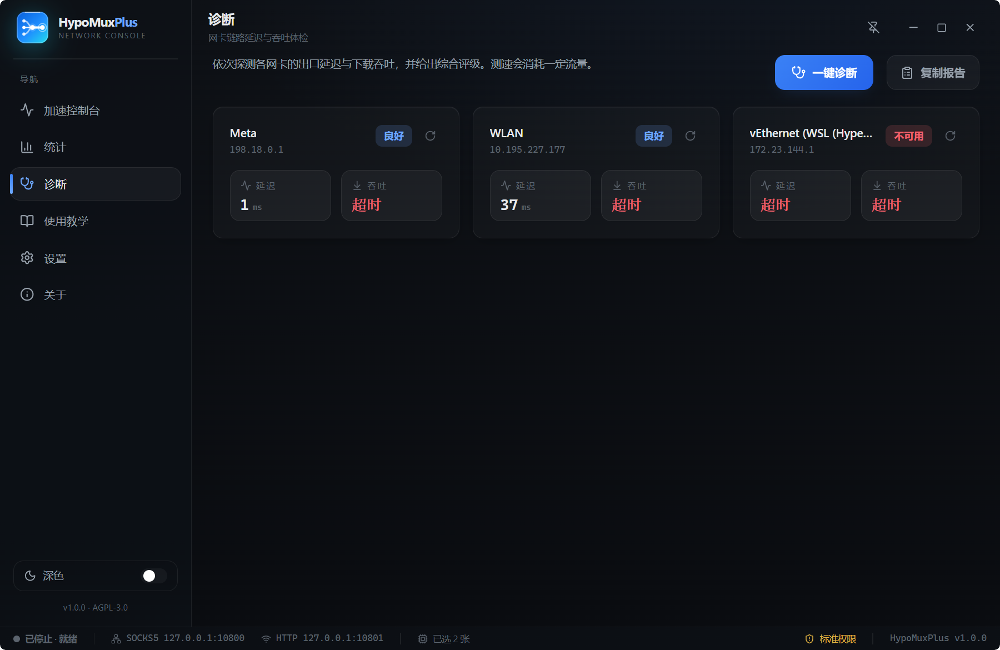
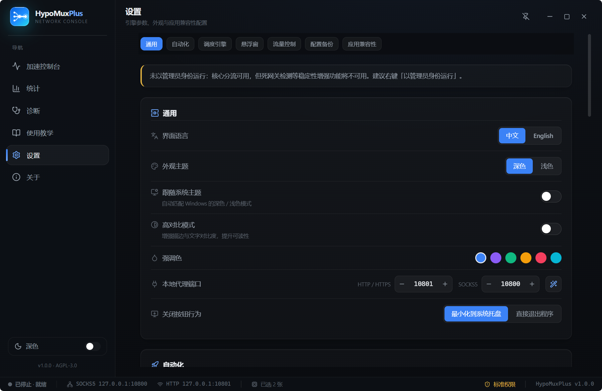

<div align="center">


# HypoMuxPlus

**多网卡带宽聚合工具**

[](https://tauri.app)
[](https://www.rust-lang.org)
[](https://react.dev)
[](https://www.typescriptlang.org)
[](https://tailwindcss.com)
[](#)
[](./LICENSE)

[](https://gitee.com/peng-minghang/hypo-mux-plus/releases/download/v1.0.0/HypoMuxPlus.exe)
[](https://github.com/pmh1314520/HypoMuxPlus)
[](https://gitee.com/peng-minghang/hypo-mux-plus)

**🌐 语言 / Language：简体中文 · [English](./README_EN.md)**

</div>

---

HypoMuxPlus 是一款面向 Windows 平台的**多网卡带宽聚合工具**。它在 [Hypostasis-Cat 的开源项目 HypoMux](https://github.com/Hypostasis-Cat/HypoMux) 的核心思想之上，使用 **Tauri + Rust + React + TailwindCSS** 完整重构，提供更美观、更流畅、更专业的桌面体验，并将分流引擎用 Rust（tokio）原生重写，产物为零运行时依赖的独立可执行文件。

> 本项目是基于原 HypoMux 的衍生作品，遵循其 **AGPL-3.0** 协议开源。原作者：Hypostasis-Cat；衍生开发者：**青云制作_彭明航**。

## 下载安装

- **仅支持 Windows 10 / 11**，下载后双击运行即可（建议以管理员身份运行以启用全部稳定性增强功能）。
- 直接下载：**[HypoMuxPlus.exe (v1.0.0)](https://gitee.com/peng-minghang/hypo-mux-plus/releases/download/v1.0.0/HypoMuxPlus.exe)**（Gitee 国内高速下载；海外用户可使用 [GitHub Releases](https://github.com/pmh1314520/HypoMuxPlus/releases/download/v1.0.0/HypoMuxPlus.exe)）
- 项目仓库：[GitHub](https://github.com/pmh1314520/HypoMuxPlus) · [Gitee](https://gitee.com/peng-minghang/hypo-mux-plus)
- 项目官网：**[hmp.pmhs.top](https://hmp.pmhs.top)**

## 界面预览

<div align="center">

**加速控制台**



**实时统计 · 链路体检诊断**





**偏好设置**



<sub>软件内置深 / 浅双主题与完整中英双语，更多界面预览可访问项目官网。</sub>

</div>

## 核心特性

- **双协议无感接管**：后台同时运行 SOCKS5 与 HTTP/HTTPS 转发服务，启动后自动写入 Windows WinINet 系统代理，兼容 Steam、IDM、浏览器等遵循系统代理规范的客户端。
- **L3 物理层网卡绑定**：对每条出站连接执行 `setsockopt(IP_UNICAST_IF)` 接口索引强绑定 + 源地址 bind，把流量物理钉死在指定网卡上，根治同网段多网卡的 `WinError 10049` 错网卡问题。
- **智能调度引擎**：内置三种连接调度策略——经典轮询、最少连接优先、按实时下行速度动态加权（平滑加权轮询 SWRR），让更快的网卡承担更多连接，弱链路不再拖累整体聚合。
- **链路体检与测速**：一键探测各网卡出口延迟（RTT），并支持逐张网卡下载测速跑分，帮你挑选最健康、最快的线路。
- **实时连接监控**：实时连接列表展示每条连接的目标地址与所分配的出口网卡，分流过程透明可见。
- **全生命周期代理保护**：手动停止、启动失败、窗口关闭、进程退出等所有路径都强制还原系统代理，降低代理残留导致断网的风险。
- **实时遥测大屏**：基于内核计数器（`GetIfEntry2`）的逐秒采样，展示合并下行总速度、实时波形、各网卡速度与活跃连接数。
- **现代化界面**：深色 / 浅色双主题、可自定义强调色、玻璃拟态、流畅动效、完整中英双语，矢量图标全程无 Emoji。
- **稳定性增强**：加速期间自动关闭死网关检测（Dead Gateway Detection），防止慢速链路被系统判定失效而中途罢工。
- **应用兼容性**：为 Steam / IDM 一键写入或还原 SOCKS5 代理配置。
- **全局热键与系统通知**：全局热键（默认 `Ctrl+Alt+H`，可自定义录制）在任意界面一键加速 / 停止；加速启停弹出系统通知提醒。
- **自动化**：开机自启、启动即最小化到托盘、开机后自动用上次选择的网卡开始加速。
- **累计统计**：跨会话持久化记录累计加速流量，关于页一目了然。
- **系统托盘**：支持最小化到托盘 / 直接退出两种关闭行为，托盘悬停实时显示当前聚合速率。

## 技术栈

| 层 | 技术 |
| --- | --- |
| 桌面框架 | Tauri 2（原生 WebView2，单文件、低占用） |
| 后端引擎 | Rust + tokio 异步运行时 + socket2 + windows-sys（IPHLPAPI / WinSock / WinINet） |
| 前端 | React 19 + TypeScript + Vite |
| 样式与动效 | TailwindCSS 4 + Framer Motion + Lucide 矢量图标 |

## 工作原理

```text
[多线程下载流量 (Steam / IDM / 浏览器)]
               │
               ▼  WinINet 系统全局代理自动接管
   http/https -> 127.0.0.1:10801 | socks -> 127.0.0.1:10800
               │
               ▼
   HypoMuxPlus 分流引擎 (Rust + tokio)
               │
               ▼  按策略进行连接调度
   L3 物理层套接字强绑定 (IP_UNICAST_IF + bind)
   ├── 网卡 1 (IfIndex) ──┐
   ├── 网卡 2 (IfIndex) ──┼─► 物理带宽叠加吞吐
   └── 网卡 N (IfIndex) ──┘
```

加速时程序向 `HKCU\Software\Microsoft\Windows\CurrentVersion\Internet Settings` 写入全覆盖代理链条；分流引擎收到客户端 TCP 连接后，先 `setsockopt(IPPROTO_IP, IP_UNICAST_IF, htonl(if_index))` 锁死出口物理网卡，再 `bind(local_ip, 0)` 固定源地址，强制流量剥离默认网关，实现物理多通道并进。

## 使用场景举例

只要是**相互独立、各自拥有出口带宽**的网络线路，都能并入带宽池一起叠加：

- **宿舍 · 合并室友的宽带**：你的电脑插着网线，自己的宽带最高约 10 MB/s；舍友也有一条独立宽带，同样能跑 10 MB/s。让电脑再通过 Wi-Fi 连上舍友的网络，两条线路同时进入带宽池，HypoMuxPlus 将它们叠加，下载峰值可逼近 20 MB/s。
- **再加一张网 · 手机流量入池**：两条还嫌不够？用数据线把手机以「USB 网络共享」接入电脑，手机的 4G/5G 流量就成了第三条独立线路一并纳入聚合，带宽继续往上叠。线路越多、越独立，叠加越可观。
- **家庭 / 工作室 · 多线并发**：家里有电信 + 联通双宽带，或工作室拉了多条独立专线时，可以全部勾选参与聚合，让 Steam 更新与大文件下载跑满每一条线路的上限。

> ⚠️ **关键前提**：参与聚合的线路必须各自拥有独立的出口带宽。如果你的「有线」和「无线」其实接的是同一台路由器、同一条宽带（共用同一个运营商上联），那叠加是**无效**的——它们本就在抢同一份带宽，合并后总量并不会增加。

## 使用方法

1. **环境就绪**：确保电脑同时接入多条独立网络线路（例如有线宽带 + Wi-Fi + 手机 USB 网络共享）。
2. **勾选网卡**：启动程序，等待网卡扫描完成，在「网卡分流矩阵」中勾选参与聚合的活动网卡。
3. **一键加速**：点击「一键加速」，状态切换为运行中，系统全局代理被接管。
4. **开始下载**：打开 Steam 触发更新，或在 IDM 新建多线程下载任务，控制台会显示连接调度日志，大屏实时展示各线路吞吐。
5. **干净停止**：点击「停止加速」或关闭软件，系统代理自动安全还原。

## 开发与构建

需要预先安装 [Node.js](https://nodejs.org)、[Rust](https://www.rust-lang.org/tools/install) 与 [Tauri 前置依赖](https://tauri.app/start/prerequisites/)（Windows 需 WebView2 与 MSVC 构建工具）。

```bash
# 安装前端依赖
npm install

# 开发模式（热重载）
npm run tauri dev

# 构建发行版（生成独立 exe 与安装包）
npm run tauri build
```

## 安全与边界说明

- 本工具工作在标准应用层代理与网络套接字绑定层，**不触碰游戏内存、不修改游戏封包、不注入任何 DLL**。
- 多网卡聚合本质是**多连接负载均衡**，对单线程 TCP 死速下载无法加速。
- 多网卡分流面向下载吞吐量；游玩对延迟敏感的网游前，请先「停止加速」，让网络回归单一默认网关。
- 部分稳定性增强功能（死网关检测）需要管理员权限，未提权时核心分流仍可正常使用。

## 赞助支持

HypoMuxPlus 完全免费开源！如果它帮到了您，希望您能请作者喝杯咖啡，赞助时记得备注 “HypoMuxPlus” 哦~ 赞助纯属自愿，无论是否赞助都可永久免费使用全部功能。

<div align="center">

| 微信赞赏 | 支付宝 |
| :---: | :---: |
|  |  |

**开发者联系方式：微信 `QyPmh20061026` · QQ `2124691573`**

</div>

## 致谢与衍生声明

本项目衍生自 [Hypostasis-Cat / HypoMux](https://github.com/Hypostasis-Cat/HypoMux)，核心的多网卡物理绑定思想与协议设计均源自原项目，特此致谢。HypoMuxPlus 在其基础上重写了桌面客户端的全部界面与后端引擎实现。

## 开源协议

本项目基于 **AGPL-3.0** 协议开源，与原项目保持一致。详见 [LICENSE](./LICENSE)。

- 原作者 / Original Author：**Hypostasis-Cat**
- 衍生开发者 / Derivative Developer：**青云制作_彭明航**
